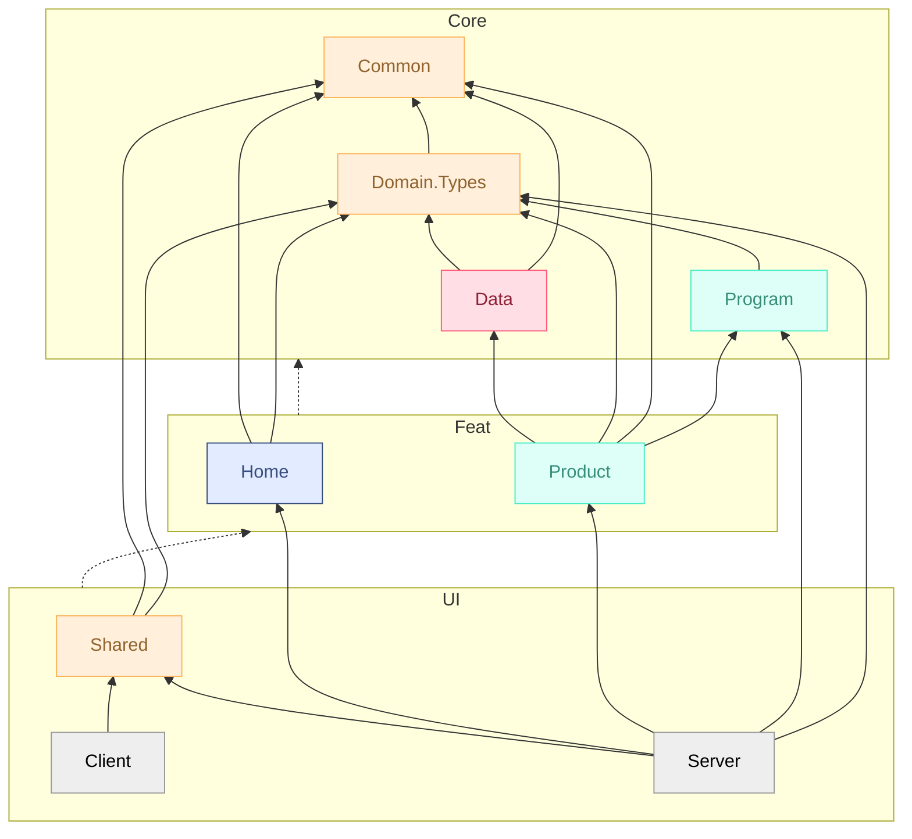

# Solution Organisation

The solution organizes projects into **logical solution folders** (`Core`, `Feat`, `UI`) that differ from the **physical disk layout** (all projects are flat under `src/` and `tests/`), and project names do not encode their solution folder either (e.g. `Shopfoo.Product`, not `Shopfoo.Feat.Product`).

* **Solution folders** provide a layered, architectural view in the IDE, making the dependencies between layers immediately visible.
* **Flat physical layout** and **short project names** keep paths simple, avoid deep nesting, and make projects easy to reference from the command line or CI scripts. The solution folder is a presentation concern, not a structural constraint.

Having logical and physical organizations differ is not common — most codebases mirror solution folders on disk. It is nonetheless an option worth considering. Whichever approach is chosen, the key architectural requirement is to **clearly separate the domain projects** (`Feat`) at the solution level, so that the solution view makes it easy to navigate to the domain projects and explore their use cases — in the spirit of [Screaming architecture](2-principles.md#screaming-architecture).

## Physical layout vs Solution folders

```txt
📂 src/
├──📂✨ Core/
│  ├──🗃️ Shopfoo.Common
│  ├──🗃️ Shopfoo.Domain.Types
│  ├──🗃️ Shopfoo.Program
│  └──🗃️ Shopfoo.Data
├──📂✨ Feat/
│  ├──🗃️ Shopfoo.Product
│  └──🗃️ Shopfoo.Home
└──📂✨ UI/
   ├──🗃️ Shopfoo.Client
   ├──🗃️ Shopfoo.Server
   └──🗃️ Shopfoo.Shared

📂 tests/
├──📂✨ Common/
│  └──🗃️ Shopfoo.Tests.Common
├──📂✨ Core/
│  └──🗃️ Shopfoo.Program.Tests
├──📂✨ Feat/
│  └──🗃️ Shopfoo.Product.Tests
└──📂✨ UI/
   └──🗃️ Shopfoo.Client.Tests

📂   = both physical directory and solution folder
🗃️   = project (physical directory)
📂✨ = extra level solution folder (virtual, not on disk)
```

## Project dependency graph



## Projects purpose

### src/Core

Foundation libraries shared across the solution.

* Used everywhere, up to `UI.Client` — can contains some `#if FABLE_COMPILER` directives:
  * **Shopfoo.Common**: Helpers for base types (`String`, `Seq`…). No dependencies.
  * **Shopfoo.Domain.Types**: Domain model: types only, with no behaviors except `Guard` clauses to prevent invalid state.
* Backend-only:
  * **Shopfoo.Data**: Data-layer helpers: HTTP, JSON/XML serialization, DI extensions.
  * **Shopfoo.Program**: The `program` computation expression, saga runner, instruction preparer, and monitoring infrastructure.

### src/Feat

Features. Each project is a **module** — a cohesive group of use cases that can range from a subset of a bounded context to an entire bounded context. The folder is named `Feat` (features) rather than `Domain` to reflect this flexibility: a module is not necessarily a 1:1 mapping with a DDD bounded context.

In *Shopfoo*, the two modules happen to match bounded contexts:

* **Shopfoo.Home**: Supportive bounded context — translations and user data access.
* **Shopfoo.Product**: Product core bounded context.

### src/UI

Presentation layer, based on the [SAFE](https://safe-stack.github.io/) stack:

* **Shopfoo.Shared**: Shared types and Remoting API contracts consumed by both Client and Server.
* **Shopfoo.Server**: ASP.NET entry point (exe). Hosts the Remoting API handlers, acts as the composition root for DI.
* **Shopfoo.Client**: SPA written in F#, compiled to JavaScript via [Fable](https://fable.io/). Follows the [Elmish](https://elmish.github.io/) MVU pattern.

### tests

* **Shopfoo.Tests.Common** (Common/): Shared test utilities and FsCheck arbitrary generators.
* **Shopfoo.Program.Tests** (Core/): Saga pattern tests with a dedicated Order domain context.
* **Shopfoo.Product.Tests** (Feat/): Product workflow tests through `IProductApi` — see [Tests](../domain-workflows/4-tests/).
* **Shopfoo.Client.Tests** (UI/): Client-side tests (filters, routing).

## Domain Workflows

Domain workflows are a cornerstone of the architecture. As such, a dedicated chapter covers them in depth: [Domain workflows](../domain-workflows/1-introduction/).

## UI

This section outlines the key organizational aspects of the UI layer. For more details, see the [Front-end](../front-end/elmish/) chapter.

### Client

The `UI/Client` contains the SPA code written in F# and compiled to JavaScript and React with Fable and Fable.React. The code follows the MVU (Model-View-Update) pattern defined by Fable.Elmish, applied via the `React.useElmish` hook. The Elmish model is composed of three elements: **Types** (`Model` and `Msg`), **State** (`init` and `update` functions, with `Cmd`s for side-effects), and **View** (the rendering function or React `FunctionComponent`).

These elements apply to both pages and components that follow the MVU pattern. Depending on the size of the page or component, they can be organized in different ways:

* **One file per element** — e.g. `Types.fs`, `State.fs`, `View.fs` — for larger pages.
* **All in one file**, either in a single module or split into dedicated `State` and `View` submodules — for smaller pages or components.

In all cases, **State is declared before View**. This separation of concerns isolates logic from rendering: thanks to F# declaration order, the compiler guarantees that State cannot call View.


It is sometimes simpler to trigger low-level view effects directly from the `update` function using `Cmd.ofEffect`, but this makes those effects harder to unit test. See [Notifications](../front-end/notifications.md) for a concrete example with toast notifications.



For an introduction to the Elm Architecture and its F# implementation, see [The Elm Architecture](https://zaid-ajaj.github.io/the-elmish-book/#/chapters/elm/) chapter in _The Elmish Book_ by Zaid Ajaj.


### Remoting API

The architecture is based on the SAFE stack template, using Fable.Remoting for Client/Server communication. The library hides HTTP plumbing behind a setup on three sides:

* **Shared:** A plain F# record defines the API contract shared by Client and Server.
* **Server:** The API is defined as a Giraffe `HttpHandler`.
* **Client:** The API is available through a proxy implementing the shared contract.

For more details, see [Remoting](../front-end/remoting.md).
