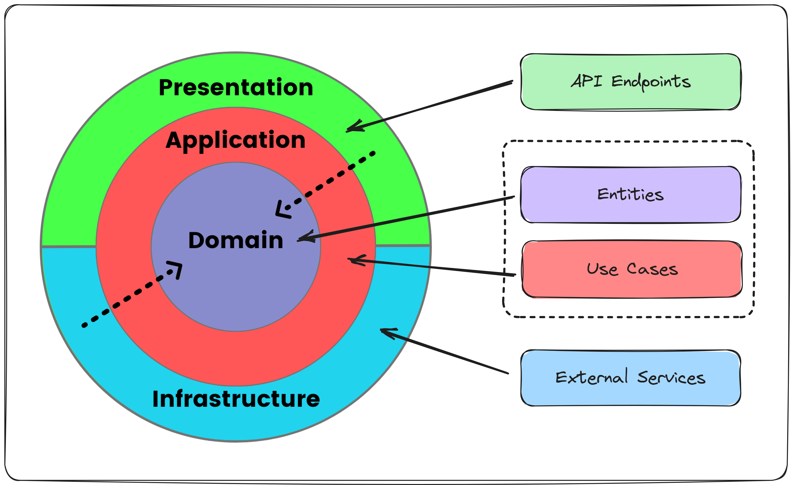
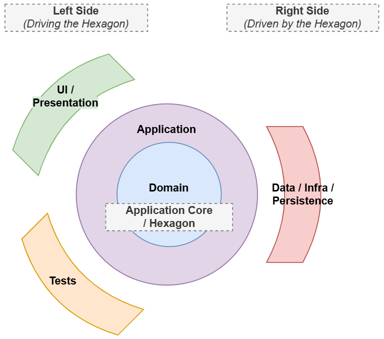
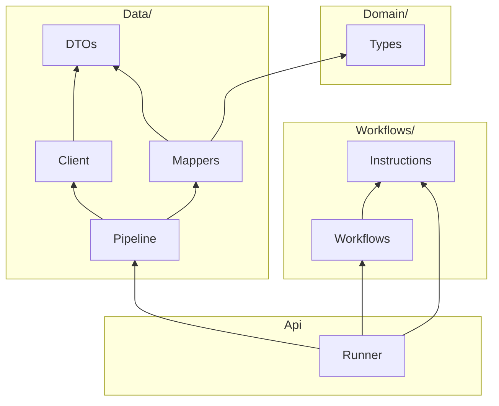
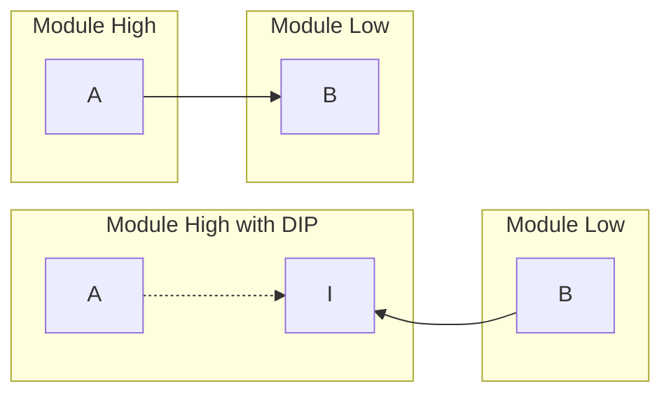

# Principles

## Architecture Principles

The following principles are either embedded in the code design, or checked using architecture tests.

### Modular Monolith

> A **modular monolith** structures the application into independent modules with well-defined boundaries, split based on logical boundaries. Modules are loosely coupled and communicate through a public API.

The application exposes modules located in the `src/Feat/` folder.


**Architecture rule:** Domain project should not reference other domain projects.


🔗 [What Is a Modular Monolith?](https://www.milanjovanovic.tech/blog/what-is-a-modular-monolith) — Milan Jovanović

### Clean Architecture



🔗 [Why Clean Architecture Is Great For Complex Projects](https://www.milanjovanovic.tech/blog/why-clean-architecture-is-great-for-complex-projects) — Milan Jovanović

The architecture maps to Clean Architecture layers:

| Layer              | Path                                              |
| ------------------ | ------------------------------------------------- |
| **Presentation**   | `src/UI/Server/`                                  |
| **Application**    | `src/Feat/Xxx/Workflows/`                         |
| **Domain**         | `src/Core/Domain.Types/`and `src/Feat/Xxx/Model/` |
| **Infrastructure** | `src/Feat/Xxx/Data/`                              |

### Hexagonal Architecture

The _Clean Architecture_ is de facto compatible with the _Hexagonal Architecture_: the hexagon surrounds the _Application_ and _Domain_ layers.

The _Hexagonal Architecture_ uses another **terminology**: dependencies are abstracted behind **ports**, implemented in outer layers by **adapters**. There are no prescribed ways to define ports and adapters: ports are not necessarily interfaces, and adapters are not necessarily referring to the _Adapter_ design pattern ([refactoring.guru](https://refactoring.guru/design-patterns/adapter), [Wikipedia](https://en.wikipedia.org/wiki/Adapter_pattern)).

It distinguishes dependencies that _drive_ the hexagon (left side) from those _driven by_ it (right side).



**Left side:** The `UI/Server` project drives domains through their `I{Domain}Api` (ports) and adapts them to the Remoting API. Tests can exercise the `I{Domain}Api`, mocking its dependencies.

**Right side:** The Data/Infrastructure layer, with two levels of "ports and adapters":

1. Application Workflows define their right ports as **Instructions**. The Workflow Runner acts as the adapter, driving the Data Pipelines.
2. Data Pipelines can expose their dependencies as interfaces (`IXxxApi`), implemented by concrete Clients, following the dependency inversion principle.



### Vertical Slice Architecture

> Instead of organizing your code by technical layers (`Controllers`, `Services`, `Repositories`), **Vertical Slice Architecture** organizes it by **business features**. Each feature becomes a **self-contained** "slice" that includes **everything needed for that specific functionality**.\
> 🔗 [Vertical Slice Architecture Is Easier Than You Think](https://www.milanjovanovic.tech/blog/vertical-slice-architecture-is-easier-than-you-think) — Milan Jovanović

The _Safe Clean Architecture_ does not implement vertical slices by the book, but applies its principle at the module level of the modular monolith: the domain projects in `src/Feat/` are self-contained, including almost all layers: Application, Domain, Infrastructure — `Workflows/` and `Data/` folders in the code.

### Screaming Architecture

> Build a system that truly "screams" about the problems it solves, \[…] that communicates its purpose through its structure.\
> By organizing your system around use cases, you align your codebase with the core business domain.\
> 🔗 [Screaming Architecture](https://www.milanjovanovic.tech/blog/screaming-architecture) — Milan Jovanović

The _Safe Clean Architecture_ applies this principle at two levels:

**Domain projects** can contain a `Workflows/` folder where each workflow (use case) is in a dedicated file.

```
Shopfoo.Product
├── Model/
├── Workflows/
│   ├── Prelude.fs
│   ├── AddProduct.fs       👈
│   ├── DetermineStock.fs   👈
│   ├── ReceiveSupply.fs    👈
│   ├── MarkAsSoldOut.fs    👈
│   ├── RemoveListPrice.fs  👈
│   ├── SavePrices.fs       👈
│   └── SaveProduct.fs      👈
├── Data/
├── Api.fs
└── DependencyInjection.fs
```


**Architecture rule:** Workflows should be in their dedicated file, named without the `Workflow` suffix.


**Remoting API** folders contain a handler per file, exposing the capabilities consumed by the Client.

```
Shopfoo.Server
├── Remoting/
│   ├── FeatApi.fs
│   ├── Security.fs
│   ├── Catalog/
│   │   ├── AddProductHandler.fs         👈
│   │   ├── GetBooksDataHandler.fs       👈
│   │   ├── GetProductsHandler.fs        👈
│   │   ├── GetProductHandler.fs         👈
│   │   ├── SaveProductHandler.fs        👈
│   │   ├── SearchAuthorsHandler.fs      👈
│   │   ├── SearchBooksHandler.fs        👈
│   │   └── CatalogApiBuilder.fs
│   ├── Home/
│   │   ├── IndexHandler.fs              👈
│   │   ├── GetTranslationsHandler.fs    👈
│   │   └── HomeApiBuilder.fs
│   ├── Prices/
│   │   ├── AdjustStockHandler.fs        👈
│   │   ├── DetermineStockHandler.fs     👈
│   │   ├── GetPricesHandler.fs          👈
│   │   ├── GetPurchasePricesHandler.fs  👈
│   │   ├── GetSalesStatsHandler.fs      👈
│   │   ├── InputSaleHandler.fs          👈
│   │   ├── SavePricesHandler.fs         👈
│   │   ├── MarkAsSoldOutHandler.fs      👈
│   │   ├── ReceiveSupplyHandler.fs      👈
│   │   ├── RemoveListPriceHandler.fs    👈
│   │   └── PricesApiBuilder.fs
│   └── RootApiBuilder.fs
├── WebApp.fs
├── DependencyInjection.fs
└── Program.fs
```


**Architecture rule:** Remoting API request handlers should be sealed and in their dedicated file.


## Design Principles

The following design principles support the architecture principles at a lower level. Their main purpose is to increase modularity by reducing coupling.

### Abstractions

Abstraction hides implementation complexity (the "how") behind a simplified, essential interface (the "what"). In OOP, an interface is the most common form; in FP, it's a function type.

**Benefits:** Decoupling, Encapsulation, Stability, Testability, Transitivity cut (dependency firewall).

**Warnings:** Beware of leaky abstractions or abstractions at the wrong level. A bad abstraction costs more than no abstraction at all. More types involved means more indirections and potentially harder navigation.

### Dependency Inversion (DIP)

This principle, abbreviated DIP, states that:

> 1. High-level modules should not import from low-level modules. Both should depend on abstractions.
> 2. Abstractions should not depend on details. Details should depend on abstractions.

It can be illustrated with the following diagram:



On the first line:

* `A` depends directly on `B`.
* `Module High` depends on `Module Low`, breaking the first statement of the DIP.

On the second line:

* `A` and `B` both depend on `I`: `A` defines `I` and wraps it, `B` implements `I`.
* The direction of dependencies is now inverted: `Module Low` depends on `Module High`, through the `I` abstraction.
* At compile time, `A` is independent of `B`, whereas at runtime `A` deals with an object whose real type is `B` in production code, or with a mock object—a.k.a. test double— in unit tests.

**Benefits:**

* **Abstractions.** DIP shares the benefits and drawbacks of abstractions.
* **Inverting Control and Ownership.** The true power of DIP lies in its ability to make high-level, policy-driving modules dictate the terms of engagement to low-level, detail-oriented modules. It goes far beyond simple swappability. **True Plug-in Architecture** is the most direct benefit, with interfaces acting as extension points. DIP is the primary mechanism for creating strong **Architectural Boundaries**. It ensures that dependencies _always_ point inward, from "Details" toward the "Core Business Rules".


**Architecture rule:** Domain types should not depend on domain projects.



**Architecture rule:** Workflows should not depend on Data types. (Enforced by F# compilation order: `Workflows/` is declared before `Data/` in the `.fsproj`.)



**Architecture rule:** Domain projects should not reference the `UI/Server` project.


The abstraction between Workflows and Data are the **program instructions** — see [Domain workflows](../domain-workflows/).

### Encapsulation

Limits direct access to internal state and behavior. Achieved mainly via `private` (inside projects) and `internal` (between projects) keywords.

**Encapsulation in the domain projects:**

* `UI/Server` should access only the `I{Domain}Api` and the `DependencyInjection` helpers.
* Test projects can access internal members using `InternalsVisibleTo` entries in `.fsproj` files.


**Architecture rule:** Domain workflows should be `internal`.



**Architecture rules for Data components:**

* Clients: `internal`
* Client Settings: `public` (needed for DI)
* Entities (DTOs): `public` (to avoid serialization issues)
* Mappers: `internal`
* Pipelines: `internal`



**Architecture rule:** Data Entities should not be used outside of their respective namespace.


### Dependency Injection

DI achieves the _Inversion of Control_ ("Don't call us, we call you!"). Dependencies appear in the type definition:

* **C# way:** Constructor parameters — e.g. `UI/Server/Remoting/{Page}/{Request}Handler` depends on `FeatApi`.
* **F# way:** Function parameters — e.g. `Feat/{Domain}/Data/{Api}/{Api}Pipeline` depends on `{Api}Client(s)`.
* **Program:** Abstracted as instructions in the program-based domain workflows.

#### DI Container

The DI container handles object instantiation, life cycle (transient, scoped, singleton), and dependency graphs. Each layer is responsible for configuring the DI of its types, exposing `IServiceCollection` extension methods. The top-level method chains the lower-layer registrations.

## Architecture Tests

The architecture rules listed above are enforced by tests located in `tests/Shopfoo.Feat.Tests/ArchitectureTests.fs` and `tests/Shopfoo.Server.Tests/ArchitectureTests.fs`:

```
📂 Feat
└── 🧪 FeatArchitectureTests
    ├── ✅ Domain types should not depend on feat projects
    ├── ✅ Feat data clients should be internal
    ├── ✅ Feat data DTOs should be public to prevent serialization issues
    ├── ✅ Feat data mappers should be internal
    ├── ✅ Feat data pipelines should be internal
    ├── ✅ Feat project should not reference other feat projects
    ├── ✅ Feat project should not reference the Server project
    ├── ✅ Workflow class name should end with Workflow
    ├── ✅ Workflows should be in their dedicated file, named without the Workflow suffix
    ├── ✅ Workflows should be sealed and internal classes
    ├── ✅ Workflows should not depend on data DTOs
    └── ✅ Workflows should not depend on Data types

📂 UI
└── 🧪 ServerArchitectureTests
    ├── ✅ Remoting API request handlers should be sealed and in their dedicated file
    ├── ✅ Server project should not access data DTOs, public just to prevent serialization issues
    ├── ✅ Server project should not access Feat data layer
    └── ✅ Server project should not access Feat internal elements using InternalsVisibleTo
```
