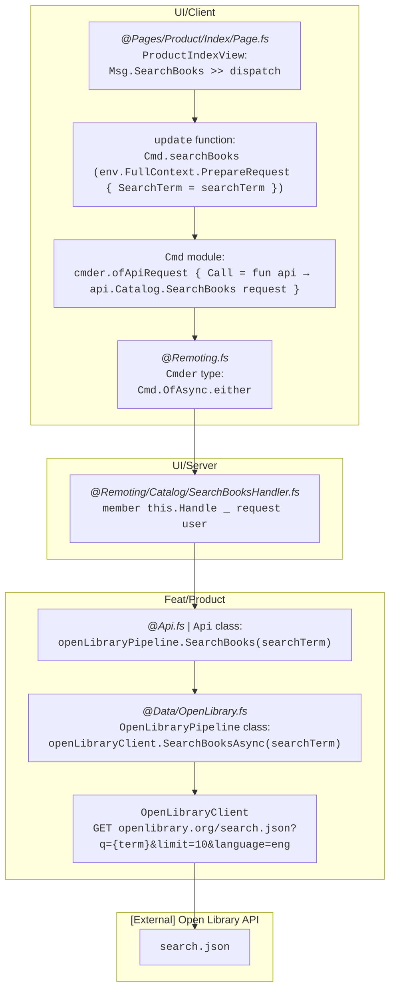
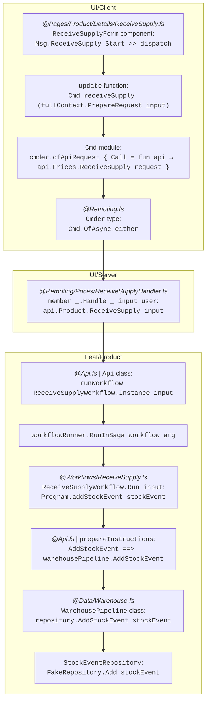

# Architecture

## Context

The target applications are full-stack applications written in F#. The architecture uniquely combines the best parts of object-oriented and functional paradigms that F# offers:

| Good parts                                      | Bad parts                                                                 |
| ----------------------------------------------- | ------------------------------------------------------------------------- |
| — **_Any paradigm_** ——                         |                                                                           |
| Separation of concerns                          | Strong coupling                                                           |
| Cohesion, Consistency                           | Technical layers                                                          |
| — **_Object-oriented_** ——                      |                                                                           |
| Abstraction, Decoupling (ISP, DIP)              | Inheritance, LSP violations                                               |
| Dependency Injection, Encapsulation             | Many files, Ceremony, Verbosity                                           |
| Clean and hexagonal architectures               | Cyclic dependencies                                                       |
| — **_Functional (in F#)_** ——                   |                                                                           |
| Lightweight syntax                              | `internal`/`private` not used enough                                      |
| Immutability, Structural equality               |                                                                           |
| Higher-order functions, Composition, Pipelines  |                                                                           |
| Null free (`Option`), Error handling (`Result`) |                                                                           |
| Compilation order, Computation expressions      |                                                                           |
| Algebraic data types                            | No [GADTs](https://en.wikipedia.org/wiki/Generalized_algebraic_data_type) |
| Strong typing                                   | No [HKTs](https://en.wikipedia.org/wiki/Kind_(type_theory))               |
| Type inference                                  | No [type classes](https://en.wikipedia.org/wiki/Type_class)               |
| Code organisation with modules                  | Modules are not first-class citizens                                      |

Note that **pattern matching** (functional) and **subtype polymorphism** (object-oriented) are two competing approaches to the same problem — branching on the shape of data. Each paradigm favours one over the other: pattern matching over discriminated unions in FP, virtual dispatch over class hierarchies in OOP. F# supports both, and the architecture leverages each where it fits best.

### Pragmatism vs Dogma

There are few F# developers in the industry, and even fewer pure-F# companies. In practice, F# codebases are often maintained by C# developers with limited F# experience. This calls for pragmatism: avoid overly purist or niche approaches, unless they offer undeniable benefits and are well documented — this book being an illustration with the [domain workflows](../domain-workflows/1-introduction/README.md) section.

Concretely, this means:

- Files can contain a single element, usually a class, especially when its name is business-related (e.g. a use case — see [Screaming architecture](2-principles.md#screaming-architecture)).
- Classes and interfaces are used where they bring clear benefits — dependency injection, DI containers, abstraction boundaries — rather than avoided on principle. A purist F# approach would rely exclusively on functions, modules, and algebraic data types, but this often leads to manual dependency threading and tighter coupling between layers.

## Overview

Implementing use cases involves a significant number of layers, each described in the following pages. The path—the call chain—starts from the front-end, traverses every layer, and reaches external APIs or storage (databases, etc. — simplified as in-memory repositories in the *Shopfoo* demo app).

This path differs slightly depending on whether the use case relies on a domain workflow. Let's illustrate this difference with two examples: the first example shows a Query without a workflow; the second illustrates a Command where a dedicated domain workflow is involved.

### Query example: Search Books

### Command example: Receive Supply

---

The following pages detail the architecture along two axes:

- [Solution Organisation](1-solution-orga.md) — physical and logical layout of the solution, project dependency graph, projects purpose, and the UI layer (Client, Remoting API, Security).
- [Principles](2-principles.md) — architecture principles (Modular Monolith, Clean / Hexagonal / Vertical Slice / Screaming Architecture) and design principles (Abstractions, DIP, Encapsulation, Dependency Injection).
