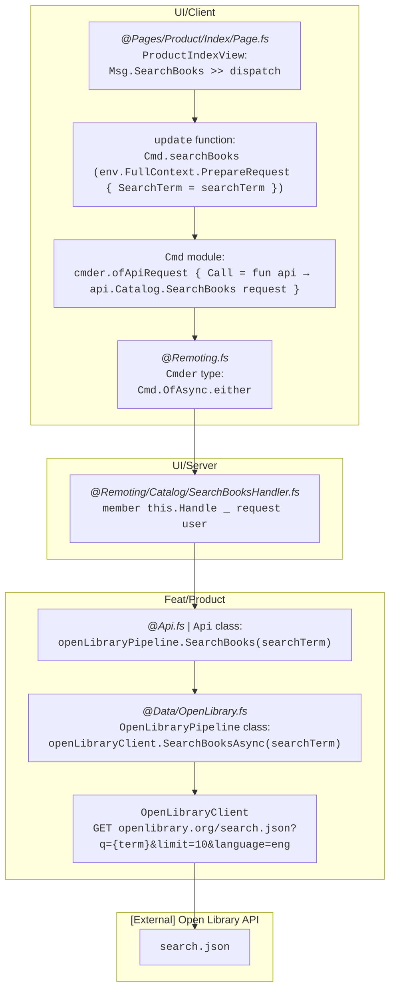
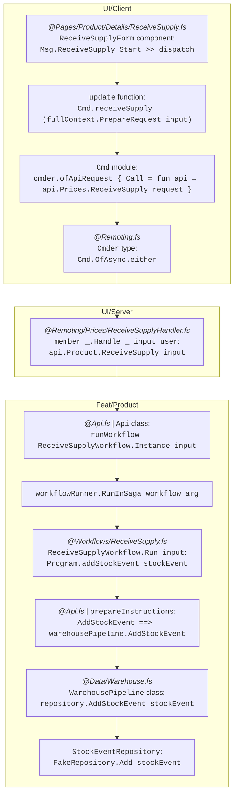

# Overview

Implementing use cases involves a significant number of layers, each described in the following pages. The path—the call chain—starts from the front-end, traverses every layer, and reaches external APIs or storage (databases, etc. — simplified as in-memory repositories in the _Shopfoo_ demo app).

This path differs slightly depending on whether the use case relies on a domain workflow. Let's illustrate this difference with two examples: the first example shows a Query without a workflow; the second illustrates a Command where a dedicated domain workflow is involved.

## Query example: Search Books

## Command example: Receive Supply

***

The following pages detail the architecture along two axes:

* [Solution Organisation](1-solution-orga.md) — physical and logical layout of the solution, project dependency graph, projects purpose, and the UI layer (Client, Remoting API, Security).
* [Principles](2-principles.md) — architecture principles (Modular Monolith, Clean / Hexagonal / Vertical Slice / Screaming Architecture) and design principles (Abstractions, DIP, Encapsulation, Dependency Injection).
