# Instructions

Each domain defines its instructions following a 5-step pattern (maintaining top-down declaration order). While not all steps are strictly mandatory, they are highly recommended as they make the code more concise and readable.

This is mostly boilerplate. You can work bottom-up (resolving compiler errors incrementally) or top-down (leveraging AI code generation).

All steps follow a naming convention to organize the code effectively. You may adopt the convention presented here or develop your own—feel free to share alternatives in the comments.

## 1. Define query and command type aliases

```fsharp
type GetPricesQuery<'a> = Query<SKU, Prices, 'a>
type GetSalesQuery<'a> = Query<SKU, Sale list, 'a>
type GetStockEventsQuery<'a> = Query<SKU, StockEvent list, 'a>
type SavePricesCommand<'a> = Command<Prices, 'a>
type SaveProductCommand<'a> = Command<Product, 'a>
```

These aliases simplify steps 2, 4, and 5. They follow this naming convention:

* Query aliases use the `Query` suffix (e.g., `GetPricesQuery`)
* Command aliases use the `Command` suffix (e.g., `SavePricesCommand`)

These aliases specialize the `Instruction` type by fixing the return type:

* `Command` returns `Result<unit, Error>`. Only the input type parameter is required (e.g., `Prices` for `SavePricesCommand`)
* `Query` returns `'ret option`. Requires both input and output type parameters (e.g., `SKU` and `Prices` for `GetPricesQuery`)

## 2. Define the discriminated union for all instructions

```fsharp
type ProductInstruction<'a> =
    | GetPrices of GetPricesQuery<'a>
    | GetSales of GetSalesQuery<'a>
    | GetStockEvents of GetStockEventsQuery<'a>
    | SavePrices of SavePricesCommand<'a>
    | SaveProduct of SaveProductCommand<'a>
```

This union type is essential for exhaustive pattern matching when interpreting domain effects (used in step 3).

Naming convention:

* Union name: `{Domain}Instruction`
* Union cases: instruction names without prefix or suffix

## 3. Define the effect interface for this union

```fsharp
[<Interface>]
type IProductEffect<'a> =
    inherit IProgramEffect<'a>
    inherit IInterpretableEffect<ProductInstruction<'a>>
```

This interface combines the two interfaces defining an effect, with `IInterpretableEffect<ProductInstruction<'a>>` fixing the domain. Used in step 4.

Naming convention: `I{Domain}Effect`

## 4. Define the effect class for each instruction

```fsharp
type GetPricesEffect<'a>(query: GetPricesQuery<'a>) =
    interface IProductEffect<'a> with
        override _.Map(f) = GetPricesEffect(query.Map f)
        override val Instruction = GetPrices query

type GetSalesEffect<'a>(query: GetSalesQuery<'a>) =
    interface IProductEffect<'a> with
        override _.Map(f) = GetSalesEffect(query.Map f)
        override val Instruction = GetSales query

type GetStockEventsEffect<'a>(query: GetStockEventsQuery<'a>) =
    interface IProductEffect<'a> with
        override _.Map(f) = GetStockEventsEffect(query.Map f)
        override val Instruction = GetStockEvents query

type SavePricesEffect<'a>(command: SavePricesCommand<'a>) =
    interface IProductEffect<'a> with
        override _.Map(f) = SavePricesEffect(command.Map f)
        override val Instruction = SavePrices command

type SaveProductEffect<'a>(command: SaveProductCommand<'a>) =
    interface IProductEffect<'a> with
        override _.Map(f) = SaveProductEffect(command.Map f)
        override val Instruction = SaveProduct command
```

This is the most verbose step, requiring four lines per instruction to define the effect class wrapping the instruction.

While adding `[<Sealed>]` would strengthen type safety, it's unnecessary since these classes are only instantiated in step 5 and don't appear elsewhere in the codebase.

Each class implements the interface from step 3:

* `Map` (from `IProgramEffect<'a>`): Signature is `Map: f: ('a -> 'b) -> IProgramEffect<'b>`. This signature is intentionally loose—it must actually return the implementing type (e.g., `GetPricesEffect`). The implementation delegates to the instruction's `Map` method, passing through the mapper function `f`.
* `Instruction` (from `IInterpretableEffect<ProductInstruction<'a>>`): Returns the corresponding union case. For `GetPricesEffect`, this is `GetPrices of GetPricesQuery<'a>`, where `GetPricesQuery<'a>` is the constructor parameter—named `query` (here) or `command`, according to the instruction type.

Naming convention template:

```fsharp
type {Instruction}Effect<'a>({instructionType}: {Instruction}{InstructionType}<'a>) =
    interface I{Domain}Effect<'a> with
        override _.Map(f) = {Instruction}Effect({instructionType}.Map f)
        override val Instruction = {Instruction} {instructionType}
```

## 5. Define helper functions for each effect

```fsharp
[<RequireQualifiedAccess>]
module Program =
    let getPrices = Program.effect GetPricesEffect GetPricesQuery
    let getSales = Program.effect GetSalesEffect GetSalesQuery
    let getStockEvents = Program.effect GetStockEventsEffect GetStockEventsQuery
    let savePrices = Program.effect SavePricesEffect SavePricesCommand
    let saveProduct = Program.effect SaveProductEffect SaveProductCommand
```

This final step defines the helper functions used to compose workflow `program`s. It leverages the lower-level `Program.effect` helper ([source](https://github.com/rdeneau/shopfoo/blob/main/src/Shopfoo.Effects/Program.fs#L85-L89)):

```fsharp
module Program =
    let inline effect (buildEffect: _ -> 'eff) (buildInstruction: _ -> Instruction<'arg, 'ret, _>) (args: 'arg) =
        let instructionName = typeof<'eff>.Name.Replace("Effect`1", "")
        Effect(buildEffect (buildInstruction (instructionName, args, Stop)))
```

This helper condenses what would otherwise be several lines per instruction. It accepts the effect constructor, instruction constructor, and instruction argument. The effect type allows extracting the instruction name. The helper assembles these components into a minimal `Program` that executes the given instruction and terminates (indicated by `Stop`).

Through partial application of the first two parameters, the argument doesn't need to be specified at the call site.

Naming convention: `let {instruction} = Program.effect {Instruction}Effect {Instruction}{InstructionType}`

## <i class="fa-diagram-nested">:diagram-nested:</i> Diagram




Mermaid source code



#### Notes

* The diagram shows different architectural layers, identified by their background color, and their composition:
  * Top: _Instructions_—
  * Middle: _Effects_——and _ProductInstruction_——aggregate _Instructions_
  * Bottom: _Program_——aggregates _Effects_
* To prevent diagram clutter, only `GetPricesEffect` shows the relationship to `IProductEffect`. The same relationship applies to all `{Instruction}Effect` classes.


## Final thoughts

The number of elements involved stems from the design choice explained above, compounded by F#'s lack of Higher-Kinded Types (HKTs). This prevents generic definition of the _Functor_ type class, since F#—constrained by .NET generics—cannot parameterize over generic types themselves. However, this limitation is manageable: it simply requires defining the `Map` method explicitly for each type.

The payoff justifies the effort. By isolating the _Program_ and _Interpreter_ components, we achieve reusability across domain projects while maintaining clean domain separation.
