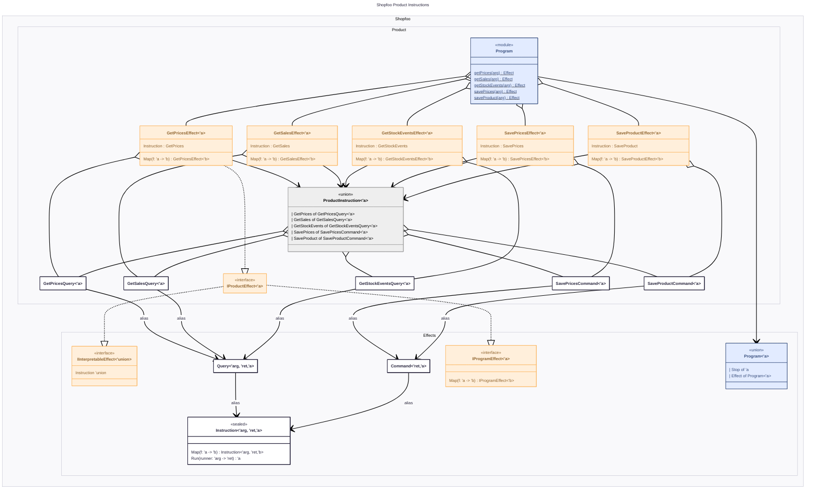

# Shopfoo Product Instructions - Mermaid Code

```mermaid
---
config:
  theme: redux
  look: classic
  class:
    hideEmptyMembersBox: true
title: Shopfoo Product Instructions
---
classDiagram
direction BT
    namespace `Shopfoo.Effects` {
        class IInterpretableEffect["IInterpretableEffect<'union>"] {
            <<interface>>
            Instruction 'union
        }

        class IProgramEffect["IProgramEffect<'a>"] {
            <<interface>>
            Map(f: 'a -> 'b) IProgramEffect<'b>
        }

        class Command["Command<'ret,'a>"]
        class Query["Query<'arg, 'ret,'a>"]

        class Instruction["Instruction<'arg, 'ret,'a>"] {
            <<sealed>>
            Map(f: 'a -> 'b) Instruction<'arg, 'ret,'b>
            Run(runner: 'arg -> 'ret) 'a
        }

        class Program["Program<'a>"] {
            <<union>>
            | Stop of 'a
            | Effect of Program<'a>
        }
    }

    namespace `Shopfoo.Product` {
        class GetPricesQuery["GetPricesQuery<'a>"]
        class GetSalesQuery["GetSalesQuery<'a>"]
        class GetStockEventsQuery["GetStockEventsQuery<'a>"]
        class SavePricesCommand["SavePricesCommand<'a>"]
        class SaveProductCommand["SaveProductCommand<'a>"]

        class ProductInstruction["ProductInstruction<'a>"] {
            <<union>>
            | GetPrices of GetPricesQuery<'a>
            | GetSales of GetSalesQuery<'a>
            | GetStockEvents of GetStockEventsQuery<'a>
            | SavePrices of SavePricesCommand<'a>
            | SaveProduct of SaveProductCommand<'a>
        }

        class IProductEffect["IProductEffect<'a>"] {
            <<interface>>
        }

        class GetPricesEffect["GetPricesEffect<'a>"] {
            Instruction : GetPrices
            Map(f: 'a -> 'b) GetPricesEffect<'b>
        }

        class GetSalesEffect["GetSalesEffect<'a>"] {
            Instruction : GetSales
            Map(f: 'a -> 'b) GetSalesEffect<'b>
        }

        class GetStockEventsEffect["GetStockEventsEffect<'a>"] {
            Instruction : GetStockEvents
            Map(f: 'a -> 'b) GetStockEventsEffect<'b>
        }

        class SavePricesEffect["SavePricesEffect<'a>"] {
            Instruction : SavePrices
            Map(f: 'a -> 'b) SavePricesEffect<'b>
        }

        class SaveProductEffect["SaveProductEffect<'a>"] {
            Instruction : SaveProduct
            Map(f: 'a -> 'b) SaveProductEffect<'b>
        }

        class ProgramModule["Program"] {
            <<module>>
            getPrices(arg) Effect$
            getSales(arg) Effect$
            getStockEvents(arg) Effect$
            savePrices(arg) Effect$
            saveProduct(arg) Effect$
        }
    }

    Query --> Instruction : alias
    Command --> Instruction : alias
    IProductEffect ..|> IInterpretableEffect
    IProductEffect ..|> IProgramEffect
    GetPricesQuery --> Query : alias
    GetSalesQuery --> Query : alias
    GetStockEventsQuery --> Query : alias
    SavePricesCommand --> Command : alias
    SaveProductCommand --> Command : alias
    ProductInstruction o-- GetStockEventsQuery
    ProductInstruction o-- SavePricesCommand
    ProductInstruction o-- SaveProductCommand
    GetPricesEffect ..|> IProductEffect
    GetPricesEffect o-- GetPricesQuery
    ProductInstruction o-- GetPricesQuery
    GetPricesEffect --> ProductInstruction
    GetSalesEffect o-- GetSalesQuery
    ProductInstruction o-- GetSalesQuery
    GetSalesEffect --> ProductInstruction
    GetStockEventsEffect o-- GetStockEventsQuery
    GetStockEventsEffect --> ProductInstruction
    SavePricesEffect o-- SavePricesCommand
    SavePricesEffect --> ProductInstruction
    SaveProductEffect o-- SaveProductCommand
    SaveProductEffect --> ProductInstruction
    ProgramModule --> Program
    ProgramModule o-- GetPricesEffect
    ProgramModule o-- GetSalesEffect
    ProgramModule o-- GetStockEventsEffect
    ProgramModule o-- SavePricesEffect
    ProgramModule o-- SaveProductEffect

    class IInterpretableEffect:::Peach
    class IProgramEffect:::Peach
    class IProductEffect:::Peach
    class GetPricesEffect:::Peach
    class GetSalesEffect:::Peach
    class GetStockEventsEffect:::Peach
    class SavePricesEffect:::Peach
    class SaveProductEffect:::Peach
    class ProductInstruction:::Ash
    class Program:::Sky
    class ProgramModule:::Sky

    classDef Peach fill:#FFEFDB,color:#8F632D,stroke:#FBB35A,stroke-width:1px,stroke-dasharray:none
    classDef Rose  fill:#FFDFE5,color:#8E2236,stroke:#FF5978,stroke-width:1px,stroke-dasharray:none
    classDef Sky   fill:#E2EBFF,color:#374D7C,stroke:#374D7C,stroke-width:1px,stroke-dasharray:none
    classDef Aqua  fill:#DEFFF8,color:#378E7A,stroke:#46EDC8,stroke-width:1px,stroke-dasharray:none
    classDef Ash   fill:#EEEEEE,color:#000000,stroke:#999999,stroke-width:1px,stroke-dasharray:none
```
