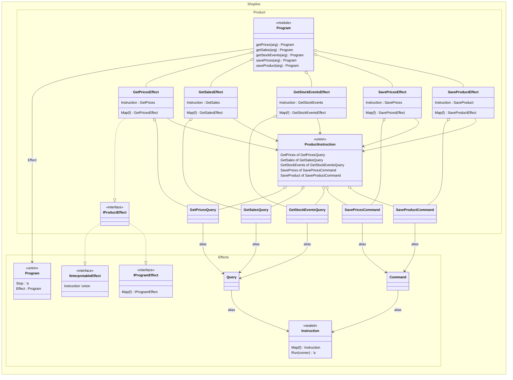

# Instructions

Each domain defines its instructions following a 5-step pattern (maintaining top-down declaration order). While not all steps are strictly mandatory, they are highly recommended as they make the code more concise and readable.

It's mostly boilerplate. You can work bottom-up (fixing compiler errors as you proceed) or top-down (leveraging AI code generation tools).

All steps should follow a naming convention to organize the code effectively. You may adopt the convention presented here or devise your own that better suits your needs—feel free to share alternatives in the comments.

## 1. Define all query and command type aliases

```fsharp
type GetPricesQuery<'a> = Query<SKU, Prices, 'a>
type GetSalesQuery<'a> = Query<SKU, Sale list, 'a>
type GetStockEventsQuery<'a> = Query<SKU, StockEvent list, 'a>
type SavePricesCommand<'a> = Command<Prices, 'a>
type SaveProductCommand<'a> = Command<Product, 'a>
```

These aliases are convenient for steps 2, 4, and 5. They follow this naming convention:

* A _Query_ alias ends with `Query`, such as `GetPricesQuery`.
* A _Command_ alias ends with `Command`, such as `SavePricesCommand`.

All that remains is to specify the generic type parameters. As a reminder, `Query` and `Command` are aliases of the `Instruction` class that fix the return type:

* A `Command` returns a `Result<unit, Error>`. Only the input type parameter needs to be specified, for example `Prices` for `SavePricesCommand`.
* A `Query` returns a `'ret option`. It therefore requires two type parameters: input and output, for example `SKU` and `Prices` respectively for `GetPricesQuery`.

## 2. Define the union type gathering all instructions

```fsharp
type ProductInstruction<'a> =
    | GetPrices of GetPricesQuery<'a>
    | GetSales of GetSalesQuery<'a>
    | GetStockEvents of GetStockEventsQuery<'a>
    | SavePrices of SavePricesCommand<'a>
    | SaveProduct of SaveProductCommand<'a>
```

This union type is only used in step 3, but it is essential for recovering exhaustiveness in the interpretation of domain effects.

The naming convention applied here:

* The union name follows the format `{Domain}Instruction`.
* The union cases use instruction names as-is, without prefix or suffix.

## 3. Define the effect interface for this union

```fsharp
[<Interface>]
type IProductEffect<'a> =
    inherit IProgramEffect<'a>
    inherit IInterpretableEffect<ProductInstruction<'a>>
```

This interface is convenient for step 4. It brings together the two interfaces defining an effect, with the second fixing the domain: `IInterpretableEffect<ProductInstruction<'a>>`. It follows the naming convention `I{Domain}Effect`.

## 4. Define the effect class corresponding to each instruction

```fsharp
type GetPricesEffect<'a>(query: GetPricesQuery<'a>) =
    interface IProductEffect<'a> with
        override _.Map(f) = GetPricesEffect(query.Map f)
        override val Instruction = GetPrices query

type GetSalesEffect<'a>(query: GetSalesQuery<'a>) =
    interface IProductEffect<'a> with
        override _.Map(f) = GetSalesEffect(query.Map f)
        override val Instruction = GetSales query

type GetStockEventsEffect<'a>(query: GetStockEventsQuery<'a>) =
    interface IProductEffect<'a> with
        override _.Map(f) = GetStockEventsEffect(query.Map f)
        override val Instruction = GetStockEvents query

type SavePricesEffect<'a>(command: SavePricesCommand<'a>) =
    interface IProductEffect<'a> with
        override _.Map(f) = SavePricesEffect(command.Map f)
        override val Instruction = SavePrices command

type SaveProductEffect<'a>(command: SaveProductCommand<'a>) =
    interface IProductEffect<'a> with
        override _.Map(f) = SaveProductEffect(command.Map f)
        override val Instruction = SaveProduct command
```

This is the most verbose step, requiring four lines per instruction to write the class defining the effect containing the instruction.

We could seal the classes with the `[<Sealed>]` attribute to strengthen type safety, but this would be even more verbose, and it's actually safe to omit it since the classes are only used in step 5 and don't appear elsewhere in the codebase.

Each class simply implements the interface defined in step 3:

* The `Map` method comes from the `IProgramEffect<'a>` interface and must follow the signature `Map: f: ('a -> 'b) -> IProgramEffect<'b>`. As mentioned previously, this signature is not precise enough to correspond to a functor. In fact, it must return the current type implementing the interface, for example `GetPricesEffect`. The mapping occurs on the object's content, namely the instruction. Since the `Instruction` class is equipped with a `Map` method, we simply delegate the mapping to it by transferring the "mapper"—the function `f` as input parameter.
* The `Instruction` property comes from the `IInterpretableEffect<ProductInstruction<'a>>` interface. It returns the union case corresponding to the instruction. For example, for `GetPricesEffect`, it's the `GetPrices of GetPricesQuery<'a>` case, where the `GetPricesQuery<'a>` corresponds to the class's input parameter, here named `query` since it's a _Query_.

The following naming convention can serve as a template:

```fsharp
type {Instruction}Effect<'a>({instructionType}: {Instruction}{InstructionType}<'a>) =
    interface I{Domain}Effect<'a> with
        override _.Map(f) = {Instruction}Effect({instructionType}.Map f)
        override val Instruction = {Instruction} {instructionType}
```

## 5. Define helper functions for each effect

```fsharp
[<RequireQualifiedAccess>]
module Program =
    let getPrices = Program.effect GetPricesEffect GetPricesQuery
    let getSales = Program.effect GetSalesEffect GetSalesQuery
    let getStockEvents = Program.effect GetStockEventsEffect GetStockEventsQuery
    let savePrices = Program.effect SavePricesEffect SavePricesCommand
    let saveProduct = Program.effect SaveProductEffect SaveProductCommand
```

This final step defines the helper functions that will be used to write the `program` for workflows. It relies on a lower-level helper—`Program.effect`—whose [source code](https://github.com/rdeneau/shopfoo/blob/main/src/Shopfoo.Effects/Program.fs#L85-L89) is:

```fsharp
module Program =
    let inline effect (buildEffect: _ -> 'eff) (buildInstruction: _ -> Instruction<'arg, 'ret, _>) (args: 'arg) =
        let instructionName = typeof<'eff>.Name.Replace("Effect`1", "")
        Effect(buildEffect (buildInstruction (instructionName, args, Stop)))
```

This helper simplifies code that would otherwise occupy several lines per instruction. It takes the effect, the instruction, and the instruction's argument as input. The effect type allows deducing the instruction name. Finally, the helper assembles all the pieces to construct the mini `Program` that only runs the given instruction and terminates, as indicated by the use of the final `Stop`.

In usage, we don't need to specify the argument thanks to partial application of the first two of three parameters. The template defining the naming convention is `let {instruction} = Program.effect {Instruction}Effect {Instruction}{InstructionType}`.

## <i class="fa-diagram-nested">:diagram-nested:</i> Overview diagram




### Remark

To avoid overloading this diagram, the relationship between the `{Instruction}Effect` classes and the `IProductEffect` interface is only shown for `GetPricesEffect`.


