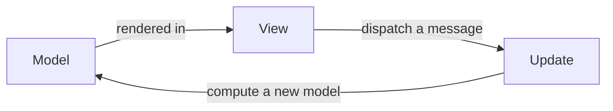

# Elmish

**Elmish** is an F# implementation of the [Elm Architecture](https://guide.elm-lang.org/architecture/) (also known as MVU — Model-View-Update). It structures UI logic around basic concepts:

* **Model**: immutable state, generally a record
* **Messages** (`Msg`): discriminated union of possible events
* `update`: function that produces a new model and optional side effects (`Cmd`)
* `view`: pure function that renders the model and dispatches messages

**Benefits:**

* This unidirectional data flow makes state changes predictable and easy to reason about.
* The `update` function is straightforward to unit test (setting `Cmd` values aside).
* Even though commands can trigger asynchronous operations (API calls, timers, etc.), our application code remains entirely synchronous — async orchestration is handled at a higher level by the Elmish runtime.

In the F# ecosystem, Elmish is provided by the [Fable.Elmish](https://elmish.github.io/elmish/) library and integrates with React through [Feliz](https://zaid-ajaj.github.io/Feliz/).


Managing local React state (e.g. via `React.useState`) alongside an Elmish model can interfere with the purity of the MVU loop. The Elmish model is no longer the single source of truth: some state lives outside `update`, invisible to the message-driven data flow, and harder to test. Use React hooks for truly view-only concerns (e.g., toggling a UI element), but prefer the Elmish model for any state that influences business logic or data flow.

