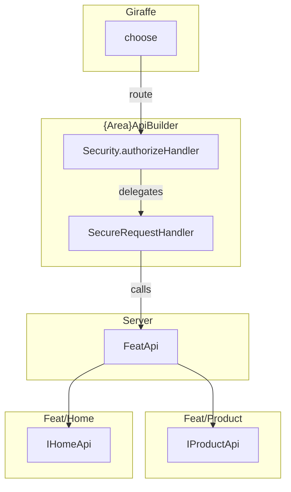

# Remoting

## Overview

*Shopfoo* uses [Fable.Remoting](https://github.com/Zaid-Ajaj/Fable.Remoting) for type-safe, contract-first communication between the Fable/Elmish client and the ASP.NET/Giraffe server. The API contract is a set of F# record types defined in the shared project, so the compiler guarantees that both sides agree on the shape of every request and response.

On top of the library itself, *Shopfoo* adds a small framework:

- **Shared** (`Shopfoo.Shared/Remoting.fs`) — The API contract: request/response wrappers, command/query type aliases, and the `{Area}Api` records.
- **Server** (`Shopfoo.Server/WebApp.fs`, `Remoting/` folder) — Giraffe HTTP handlers, authorization, and the handler class hierarchy.
- **Client** (`Shopfoo.Client/Server.fs`, `Shopfoo.Client/Remoting.fs`) — The proxy, the `Cmder` helper, and the `Remote<'a>` type for MVU models.

## The API contract (Shared)

### Route convention

All Remoting routes follow a single pattern defined in `Route.builder`:

```fsharp
module Route =
    let builder pageName methodName = $"/api/%s{pageName}/%s{methodName}"
```

For example, `CatalogApi.GetProducts` resolves to `/api/CatalogApi/GetProducts`. This builder is used identically on both sides (server and client), so the routes always match.


Do not confuse `/api/...` routes (Remoting RPC) with client-side page routes (`/books/...`, `/about`...) handled by Feliz.Router.


### `Request<'t>` and `Response<'a>`

Every Remoting call transmits a `Request<'t>` envelope and returns a `Response<'a>`:

```fsharp
type Request<'t> = {
    Token: AuthToken option
    Lang: Lang
    Body: 't
}

type ServerError =
    | ApiError of ApiError
    | AuthError of AuthError

type Response<'a> = Result<'a, ServerError>
```

- `Token` — The encrypted auth token (see [Security](security.md)). `None` for anonymous users.
- `Lang` — The user's current language, so the server can return the right translations.
- `Body` — The actual payload, generic over the request type.
- `ServerError` — Either a domain/technical error (`ApiError`) or an authentication failure (`AuthError`).

### `Command` and `Query` type aliases

Three type aliases capture the two main interaction patterns:

```fsharp
type Command<'command'>       = Request<'command'> -> Async<Response<unit>>
type Query<'query, 'response> = Request<'query>    -> Async<Response<'response>>

type QueryWithTranslations<'query, 'response> =
    Query<QueryDataAndTranslations<'query>, 'response * Translations>
```

- **`Command`** — A write request (with side effects) that returns nothing on success (only errors). Examples: `SaveProduct`, `AdjustStock`.
- **`Query`** — A read request (no side effects) that returns a typed response. Examples: `GetBooksData`, `SearchAuthors`.
- **`QueryWithTranslations`** — A query that also returns a `Translations` bundle alongside the response. The client sends a `QueryDataAndTranslations` that includes the set of `PageCode`s whose translations are missing locally, and the server piggybacks the translations in the response. This avoids a separate round-trip for translations.

### `ResponseBuilder`

The `ResponseBuilder` module provides two factory functions that create `IResponseBuilder` instances used by server-side handlers:

```fsharp
ResponseBuilder.plain<'a> user             // IResponseBuilder<'a, 'a>
ResponseBuilder.withTranslations<'a> user  // IResponseBuilder<'a * Translations, 'a>
```

Both handle `ApiError` conversion (mapping domain `Error` to `ApiError` with the right detail level for the user) and the `Ok` path. The `withTranslations` variant tacks a `Translations` bundle onto the success value.

### The `{Area}Api` records and `IAreaApi`

Each functional area of the front-end — `HomeApi`, `CatalogApi`, `PricesApi`, `AdminApi` — exposes its contract as a record type implementing the `IAreaApi` marker interface. Every field is either a `Command<_>`, a `Query<_, _>`, or a `QueryWithTranslations<_, _>`:

```fsharp
type CatalogApi = {
    GetBooksData: Query<unit, GetBooksDataResponse>
    GetProducts: QueryWithTranslations<Provider, GetProductsResponse>
    GetProduct: QueryWithTranslations<SKU, GetProductResponse>
    SaveProduct: Command<Product>
    AddProduct: Command<Product>
    SearchAuthors: Query<SearchAuthorsRequest, SearchAuthorsResponse>
    SearchBooks: Query<SearchBooksRequest, SearchBooksResponse>
} with
    interface IAreaApi
```

These Remoting APIs follow the **Backend For Frontend** (BFF) principle: they are designed around the client's needs (pages, UI flows), not around the domain structure. There is a deliberate decoupling between the Remoting APIs (`HomeApi`, `CatalogApi`, `PricesApi`, `AdminApi`) and the server-side Feat projects (`Home`, `Product`). Even when the names overlap (e.g. `HomeApi` and the `Home` Feat), the split is intentional — it allows each side to evolve independently.

All APIs are aggregated into a single `RootApi` record:

```fsharp
type RootApi = {
    Admin: AdminApi
    Catalog: CatalogApi
    Home: HomeApi
    Prices: PricesApi
}
```

This `RootApi` is the single entry point used by both the server (to wire handlers) and the client (to build the proxy).

### Request/response DTOs

Each `{Area}Api` module also defines its own request and response DTOs as small records. These are pure data containers shared between client and server:

```fsharp
type GetBooksDataResponse = { Authors: Set<BookAuthor>; Tags: Set<BookTag> }
type SearchBooksRequest   = { SearchTerm: string }
type SearchBooksResponse  = { Books: SearchedBook list; TotalCount: int }
```

Notice that these DTOs directly reference domain types (`BookAuthor`, `BookTag`, `Product`, `SKU`...). This is one of the major benefits of the SAFE stack: since the same F# code compiles to both .NET (server) and JavaScript (client via Fable), there is no need to maintain separate DTO layers or map between different languages (e.g. C# on the backend, TypeScript on the frontend). Domain types — records and discriminated unions — are immutable and carry no behavior by convention, which makes them natural DTOs: they transfer data safely without exposing server-side internals.

This remains compatible with domain types that use smart constructors to prevent invalid states (e.g. a `SKU` that enforces a format, or a `Prices` record that validates business rules). Smart constructors are only enforced on the server, at the domain boundary where data enters the system. Once a value has been validated and persisted, it is safe to serialize and send to the client as-is — deserialization bypasses the smart constructor, but this is fine because the data was already validated at the source. The client mostly reads and displays these values. When it does need to create a domain object (e.g. building a `Product` from form inputs), a smart constructor failure simply surfaces as a validation error that the UI can report to the user.

## `ApiError` — the front-end-friendly error type

Domain logic uses an `Error` discriminated union (`BusinessError`, `Bug`, `DataError`, `Validation`...). This union is server-side only — it relies on exception types and internal details that are not Fable-compatible. But even if it were, exposing it to the front-end would be a security breach: the `Bug` case carries an exception whose stack trace reveals internal class names and file paths.

`ApiError` (defined in `Shopfoo.Shared/Errors.fs`) is the client-facing replacement, designed specifically for error display in the UI (toast notifications, form feedback, error pages):

```fsharp
type ApiError = {
    ErrorCategory: string
    ErrorMessage: string
    ErrorType: ErrorType // Business | Technical
    ErrorKey: TranslationKey option
    ErrorDetail: ErrorDetail option
    Translations: Translations
}
```

Key design points:

- **`ErrorType`** distinguishes business errors (user-friendly message, suitable for toast or form feedback) from technical errors (unexpected failures, shown differently in the UI).
- **`ErrorCategory`** is a classification string exposed only to admin users (empty for non-admins).
- **`ErrorKey`** is an optional translation key that the client can use to display a localized error message.
- **`ErrorDetail`** (exception text / stack trace) is only populated for admin users, preventing technical disclosure to regular users.
- **`Translations`** can carry additional translations needed to render the error in the UI.

The `ApiError.FromError` factory method converts a domain `Error` into an `ApiError`, adapting the detail level based on the user's `ErrorDetailLevel`:

```fsharp
static member FromError(error, level, ?key, ?translations) =
    match error with
    | BusinessError _ -> ApiError.Business(errorMessage, ...)
    | Bug exn         -> ApiError.Technical(errorMessage, ..., ?detail = exn.AsErrorDetail(level), ...)
    | Validation _    -> ApiError.Business(errorMessage, ...)
    | ...
```

An `ApiError.FromException` factory is also available for unhandled exceptions (e.g. `ProxyRequestException` on the client side).

## Server side

The server side wires together authorization, request handling, and Giraffe routing. Each `{Area}Api` record is built by a dedicated builder that instantiates handlers and wraps them with security. The assembled APIs are then exposed as HTTP endpoints through Giraffe's `choose` combinator.



### `SecureRequestHandler` — the handler base type

Each Remoting endpoint is implemented as a sealed class inheriting from `SecureRequestHandler<'requestBody, 'response>`:

```fsharp
[<AbstractClass>]
type SecureRequestHandler<'requestBody, 'response>() =
    abstract member Handle: lang: Lang -> request: 'requestBody -> user: User -> Async<Response<'response>>
```

The following aliases make intent explicit:

```fsharp
type SecureCommandHandler<'command>                           = SecureRequestHandler<'command, unit>
type SecureQueryHandler<'query, 'response>                    = SecureRequestHandler<'query, 'response>
type SecureQueryDataAndTranslationsHandler<'query, 'response> = SecureRequestHandler<QueryDataAndTranslations<'query>, 'response * Translations>
```

Using a class rather than a plain function (more idiomatic in F#) is a deliberate choice for several reasons:

- **CQRS convention** — This follows the classic `CommandHandler` / `QueryHandler` pattern found in CQRS architectures (typically in C#). The base type serves as a marker that `Security.authorizeHandler` can target: it guarantees that the requesting user's claims have been verified before the handler executes.
- **Screaming Architecture** — A sealed class naturally maps to a dedicated file, making the application's capabilities visible in the file tree. See the [Screaming Architecture](../architecture/2-principles.md#screaming-architecture) principle.

  ```text
  Remoting/
  ├── Admin/
  │   ├── ResetProductCacheHandler.fs  👈
  │   └── AdminApiBuilder.fs
  ├── Catalog/
  │   ├── AddProductHandler.fs         👈
  │   ├── GetBooksDataHandler.fs       👈
  │   ├── GetProductHandler.fs         👈
  │   ├── GetProductsHandler.fs        👈
  │   ├── SaveProductHandler.fs        👈
  │   ├── SearchAuthorsHandler.fs      👈
  │   ├── SearchBooksHandler.fs        👈
  │   └── CatalogApiBuilder.fs
  ├── Home/
  │   ├── GetTranslationsHandler.fs    👈
  │   ├── IndexHandler.fs              👈
  │   └── HomeApiBuilder.fs
  ├── Prices/
  │   ├── AdjustStockHandler.fs        👈
  │   ├── DetermineStockHandler.fs     👈
  │   ├── GetPricesHandler.fs          👈
  │   ├── GetPurchasePricesHandler.fs  👈
  │   ├── GetSalesStatsHandler.fs      👈
  │   ├── InputSaleHandler.fs          👈
  │   ├── MarkAsSoldOutHandler.fs      👈
  │   ├── ReceiveSupplyHandler.fs      👈
  │   ├── RemoveListPriceHandler.fs    👈
  │   ├── SavePricesHandler.fs         👈
  │   └── PricesApiBuilder.fs
  ├── FeatApi.fs
  ├── Security.fs
  └── RootApiBuilder.fs
  ```


`SecureRequestHandler` is an abstract class rather than an interface, even though it has a single abstract member (which would normally favor an interface for better decoupling). The reason is pragmatic: in F#, interface implementations are always explicit — calling code must upcast to the interface to access its members. With a single-member type, this trade-off is acceptable and keeps the code more concise and readable.



Inheritance must stop at one level: each concrete handler is `[<Sealed>]` and directly inherits one of the aliases below. There is no deeper hierarchy. The compiler does not and can not enforce this, but the architecture test `Remoting API request handlers should be sealed and in their dedicated file` verifies that all handlers inheriting `SecureRequestHandler` are sealed.


A typical handler receives its dependencies via constructor injection, calls into domain APIs, and returns through the `ResponseBuilder`:

```fsharp
[<Sealed>]
type IndexHandler(api: FeatApi, authorizedPageCodes) =
    inherit SecureQueryDataAndTranslationsHandler<unit, HomeIndexResponse>()

    override _.Handle lang request user =
        async {
            let! personas = api.Home.GetPersonas()
            let! translations =
                api.Home.GetAllowedTranslations {
                    lang = lang
                    allowed = authorizedPageCodes
                    requested = request.TranslationPages
                }
            let response = ResponseBuilder.withTranslations user translations
            return
                match personas with
                | Ok personas -> response.Ok { Personas = [...] }
                | Error error -> response.ApiError error
        }
```

### `FeatApi` — the domain gateway

Handlers receive their domain dependencies through `FeatApi`, a singleton that aggregates the feature-level APIs:

```fsharp
type FeatApi(home: IHomeApi, product: IProductApi) =
    member val Home = home
    member val Product = product
```

This keeps handlers decoupled from the DI container — they only see the domain interfaces they need.

### Authorization with `Security.authorizeHandler`

Every handler is wrapped with `Security.authorizeHandler` before being assigned to its `{Area}Api` field:

```fsharp
member _.Build() : CatalogApi = {
    GetBooksData = GetBooksDataHandler(api)       |> Security.authorizeHandler (claim Access.Edit)
    GetProducts  = GetProductsHandler(api, pages) |> Security.authorizeHandler (claim Access.View)
    SaveProduct  = SaveProductHandler(api)        |> Security.authorizeHandler (claim Access.Edit)
    ...
}
```

`authorizeHandler` decrypts and validates the `AuthToken` from the request, checks that the user holds the required claims, and either returns an `AuthError` or delegates to the handler's `Handle` method with the verified `User`:

```fsharp
let authorizeHandler (claims: Claims) (handler: SecureRequestHandler<_, _>) request =
    async {
        match checkToken claims request.Token with
        | Error authError -> return Error(ServerError.AuthError authError)
        | Ok authorizedUser -> return! handler.Handle request.Lang request.Body authorizedUser
    }
```

### `{Area}ApiBuilder` — wiring the APIs

Each API area has a builder class (e.g. `CatalogApiBuilder`, `HomeApiBuilder`) that instantiates the handlers and wraps them with authorization. A top-level `RootApiBuilder` composes them all:

```fsharp
type RootApiBuilder(adminApiBuilder, catalogApiBuilder, homeApiBuilder, pricesApiBuilder) =
    member _.Build() : RootApi = {
        Admin   = adminApiBuilder.Build()
        Catalog = catalogApiBuilder.Build()
        Home    = homeApiBuilder.Build()
        Prices  = pricesApiBuilder.Build()
    }
```

All builders are registered as singletons in `DependencyInjection.fs`.

### Giraffe routing with `choose`

In `WebApp.fs`, each API record is turned into a Giraffe `HttpHandler` via `areaApiHttpHandler`, then combined with Giraffe's `choose` combinator:

```fsharp
let private areaApiHttpHandler (api: #IAreaApi) =
    Require.services<ILogger<WebApp>> (fun logger ->
        Remoting.createApi ()
        |> Remoting.withErrorHandler (errorHandler logger)
        |> Remoting.withRouteBuilder Route.builder
        |> Remoting.fromValue api
        |> Remoting.buildHttpHandler)

let webApp (rootApi: RootApi) : HttpHandler =
    choose [
        areaApiHttpHandler rootApi.Admin
        areaApiHttpHandler rootApi.Catalog
        areaApiHttpHandler rootApi.Home
        areaApiHttpHandler rootApi.Prices
    ]
```


This wiring is **not** compile-safe: if a new `{Area}Api` is added to `RootApi` but not listed in `choose`, there is no compiler error — the missing API simply returns HTTP 404 at runtime. Be sure to update `webApp` when adding a new API.


The custom `errorHandler` logs the exception and returns a case of Fable.Remoting's `ErrorResult` union: `Propagate` sends the error to the client as an `ApiError` (for known F# exceptions like `failwith`, `invalidArg`...), while `Ignore` swallows it (for unexpected errors), preventing technical disclosure:

```fsharp
let private errorHandler logger (FirstException exn) (routeInfo: RouteInfo<HttpContext>) =
    logger.LogError(exn, $"Error at %s{routeInfo.path} on method %s{routeInfo.methodName}")
    match exn with
    | Operators.Failure _          // raise, failwith
    | :? ArgumentException         // invalidArg
    | :? InvalidOperationException // invalidOp
        -> Propagate(ApiError.Technical(exn.Message, ?detail = exn.AsErrorDetail()))
    | _ -> Ignore
```

## Client side

### `Server.fs` — the Remoting proxy

`Server.fs` builds the Fable.Remoting client proxy — a single `RootApi` value whose fields are auto-generated proxies that perform HTTP calls:

```fsharp
let private options =
    Remoting.createApi ()
    |> Remoting.withRouteBuilder Route.builder

let api: RootApi = {
    Admin   = Remoting.buildProxy options
    Catalog = Remoting.buildProxy options
    Home    = Remoting.buildProxy options
    Prices  = Remoting.buildProxy options
}
```

Calling `Server.api.Catalog.GetProducts request` transparently serializes the request, issues a POST to `/api/CatalogApi/GetProducts`, and deserializes the response — all type-safe, no manual HTTP code.

### `Remoting.fs` — the MVU integration layer

This file provides the types and helpers that connect Remoting to the Elmish MVU architecture.

#### `ApiResult<'response>` and `ApiCall<'response>`

Two types structure the messages flowing through the Elmish loop:

```fsharp
type ApiResult<'response> = Result<'response, ApiError>

type ApiCall<'response> =
    | Start
    | Done of ApiResult<'response>
```

The key difference between the two:

- **`ApiResult`** is used for data fetched at page load time. The `init` function fires a `Cmd` and the resulting `Msg` directly carries the `ApiResult` — there is no need for a `Start` phase since the call is triggered automatically:

```fsharp
type Msg =
    | HomeDataFetched of ApiResult<HomeIndexResponse * Translations>
```

- **`ApiCall`** is used for actions triggered by the user (save, delete...). The `Start` case is dispatched from the view (e.g. on button click), while the `Done` case is handled in the `update` function when the server responds:

```fsharp
type Msg =
    | SaveProduct of Product * ApiCall<unit>
```

Note that the `Product` parameter is placed in the `Msg` case itself, not inside a `Start` payload. This makes it available in both the `Start` and `Done` branches of the `update` function, but it comes at a cost: the `Cmd` function must explicitly rewrap the body in the `Done` case, making the `cmder.ofApiRequest` call more verbose:

```fsharp
let saveProduct (cmder: Cmder, request) =
    cmder.ofApiRequest {
        Call = fun api -> api.Catalog.SaveProduct request
        Error = fun err -> SaveProduct(request.Body, Done(Error err))
        Success = fun () -> SaveProduct(request.Body, Done(Ok()))
    }
```


These types are inspired by similar helpers in the ecosystem:

- The [SAFE.Utils](https://github.com/SAFE-Stack/SAFE.Utils) package provides `ApiCall<'TStart, 'TFinished> = Start of 'TStart | Finished of 'TFinished` — a more generic variant with a parameterized `Start`. In practice, a `Start` parameter is rarely needed, so *Shopfoo* omits it. When one is needed, it is placed directly in the `Msg` case (e.g. `SaveProduct of Product * ApiCall<unit>`), as shown above.
- The [Elmish Book](https://zaid-ajaj.github.io/the-elmish-book/#/chapters/commands/async-state) proposes `AsyncOperationStatus<'t> = Started | Finished of 't`, which is equivalent to our `ApiCall` up to naming.

Both recommend using `Result` to model operations that might fail. *Shopfoo*'s `ApiResult` does the same, while being more specific about the error type (`ApiError`).


#### `Cmder` — the command builder

`Cmder` wraps calls to the Remoting API into Elmish `Cmd` values. It is obtained from `FullContext`:

```fsharp
type Cmder = { User: User }

type FullContext with
    member this.Cmder: Cmder = { User = this.User }
```

Its single method, `ofApiRequest`, takes an `ApiRequestArgs` record and produces a `Cmd<'msg>`:

```fsharp
type ApiRequestArgs<'response, 'msg> = {
    Call: RootApi -> Async<Response<'response>>
    Error: ApiError -> 'msg
    Success: 'response -> 'msg
}
```

- **`Call`** — A function that takes the `RootApi` proxy and returns the async call.
- **`Error`** / **`Success`** — Callbacks that wrap the result into the page's `Msg` type.

Internally, `ofApiRequest` calls `Cmd.OfAsync.either`, and handles both `ServerError` variants (converting `AuthError` to `ApiError`) and unhandled exceptions (converting `ProxyRequestException` to `ApiError.Technical`).

Compared to calling `Cmd.OfAsync.either` directly, `ofApiRequest` is slightly more verbose but much more readable: the named fields `Call`, `Success`, and `Error` make the intent of each callback immediately visible, whereas the curried arguments of `Cmd.OfAsync.either` are positional and easy to mix up. The `Call` field taking a lambda (`fun api -> ...`) also improves developer experience: it enables IntelliSense and auto-completion on the `api` record and its methods, making it easy to discover available endpoints.

#### `FullContext.PrepareRequest` and `PrepareQueryWithTranslations`

`FullContext` provides two helpers that produce the `(Cmder, Request<'a>)` tuple expected by `Cmd` module functions:

```fsharp
type FullContext with
    member this.PrepareRequest body =
        let secureRequest: Request<'a> = {
            Token = this.Token
            Lang = this.Lang
            Body = body
        }
        this.Cmder, secureRequest

    member this.PrepareQueryWithTranslations query =
        this.PrepareRequest { Query = query; TranslationPages = this.Translations.EmptyPages }
```

`PrepareQueryWithTranslations` automatically includes the set of translation pages that the client is still missing, so the server can piggyback them in the response. More details in [translations](translations.md).

#### The `module Cmd` convention

Each page or component that talks to the server defines a private `Cmd` module inside its own module. Each function in this module takes a `(Cmder, Request<_>)` tuple and returns a `Cmd<Msg>`:

```fsharp
[<RequireQualifiedAccess>]
module private Cmd =
    let loadPrices (cmder: Cmder, request) =
        cmder.ofApiRequest {
            Call = fun api -> api.Prices.GetPrices request
            Error = Error >> PricesFetched
            Success = Ok >> PricesFetched
        }

    let saveProduct (cmder: Cmder, request) =
        cmder.ofApiRequest {
            Call = fun api -> api.Catalog.SaveProduct request
            Error = fun err -> SaveProduct(request.Body, Done(Error err))
            Success = fun () -> SaveProduct(request.Body, Done(Ok()))
        }
```

This convention keeps all remoting side-effects grouped together and separate from the `update` logic. The `[<RequireQualifiedAccess>]` attribute brings an additional benefit: every call site reads `Cmd.loadPrices`, `Cmd.saveProduct`... making it immediately obvious that a command is being issued. It also unifies the code style in the `Cmd` track returned by `init` and `update` (the second element of the `Model * Cmd` pair): it always starts with `Cmd.`, whether it refers to this module or to Elmish's built-in helpers (`Cmd.none`, `Cmd.batch`, `Cmd.ofEffect`...).

#### Usage in `init` and `update`

Translations are typically needed only once per page, at load time. As a result, `PrepareQueryWithTranslations` is generally called only once, in the `init` function. All subsequent calls (in `update`) use `PrepareRequest`.

```fsharp
// init: PrepareQueryWithTranslations for the initial load (with translations)
let private init (env: #Env.IFullContext) =
    { Personas = Remote.Loading },
    Cmd.loadHomeData (env.FullContext.PrepareQueryWithTranslations())

// init: multiple parallel calls can be batched
let private init fullContext sku =
    { Prices = Remote.Loading; Stock = Remote.Loading },
    Cmd.batch [
        Cmd.loadPrices (fullContext.PrepareRequest sku)
        Cmd.determineStock (fullContext.PrepareRequest sku)
    ]

// update: PrepareRequest for subsequent calls (no translations needed)
let private update fullContext msg model =
    match msg with
    | SaveProduct(product, Start) ->
        { model with SaveDate = Remote.Loading },
        Cmd.saveProduct (fullContext.PrepareRequest product)

    | SaveProduct(_, Done result) ->
        { model with SaveDate = result |> Result.map (fun () -> DateTime.Now) |> Remote.ofResult },
        Cmd.none
```

### `Remote<'a>` — tracking async data in the model

The `Remote<'a>` discriminated union represents the lifecycle of data obtained through a remote call:

```fsharp
[<RequireQualifiedAccess>]
type Remote<'a> =
    | Empty
    | Loading
    | LoadError of ApiError
    | Loaded of 'a
```

- **`Empty`** — No data and no request in flight (initial state for optional data).
- **`Loading`** — A request is in progress (the view can show a spinner).
- **`LoadError`** — The request failed (the view can show an error message).
- **`Loaded`** — Data is available.

The `Remote` module provides two conversion helpers:

```fsharp
module Remote =
    let ofOption = function Some v -> Loaded v | None -> Empty
    let ofResult = function Ok v -> Loaded v | Error e -> LoadError e
```

A typical model uses `Remote` fields for any data fetched from the server. `Remote` acts as a marker type: scanning the `Model` fields instantly reveals which data comes from the server and which is local state.

```fsharp
type Model = {
    Products: Remote<GetProductsResponse>
    Prices: Remote<GetPricesResponse>
    SaveDate: Remote<DateTime>
}
```

The `update` function transitions between `Remote` cases as API calls progress — `Loading` when the call starts, `Loaded` on success, `LoadError` on failure:

```fsharp
let private update env msg model =
    match msg with
    // ApiCall: Start -> Loading, Done -> Loaded or LoadError
    | SaveProduct(product, Start) ->
        { model with SaveDate = Remote.Loading },
        Cmd.saveProduct (fullContext.PrepareRequest product)

    | SaveProduct(_, Done result) ->
        { model with SaveDate = result |> Result.map (fun () -> DateTime.Now) |> Remote.ofResult },
        Cmd.none

    // ApiResult: Ok -> Loaded, Error -> LoadError
    | ProductsFetched(provider, Ok(data, translations)) ->
        { model with Products = Remote.Loaded(provider, data.Products) },
        Cmd.ofEffect (fun _ -> Env.fillTranslations env translations)

    | ProductsFetched(_, Error apiError) ->
        { model with Products = Remote.LoadError apiError },
        Cmd.ofEffect (fun _ -> Env.fillTranslations env apiError.Translations)
```


As with `ApiCall`, similar types exist in the ecosystem:

- [SAFE.Utils](https://github.com/SAFE-Stack/SAFE.Utils) provides `RemoteData<'T> = NotStarted | Loading of 'T option | Loaded of 'T`
- The [Elmish Book](https://zaid-ajaj.github.io/the-elmish-book/#/chapters/commands/async-state) proposes `Deferred<'t> = HasNotStartedYet | InProgress | Resolved of 't`

Both choose not to model the error case explicitly, relying on `Result` for that (e.g. `Deferred<Result<'t, 'e>>`). This is more generic but also more verbose at usage sites. *Shopfoo*'s `Remote` takes an opinionated stance: a remote call can always fail — this is inherent — so the error case is modeled directly in the type, giving a flat union rather than a composition of two types.

All three approaches are equivalent — it comes down to what one finds more practical and what one wants to make explicit in the modeling. The SAFE stack and the Elmish Book target a broad audience and must remain generic; the *Safe Clean Architecture* (like the [SAFEr template](https://github.com/Dzoukr/SAFEr.Template)) can afford to be more opinionated.


## Data flow summary

The full round-trip for a query follows this path:

1. **Client `init`/`update`** — Calls `fullContext.PrepareQueryWithTranslations(query)` to build the `(Cmder, Request)` tuple, then passes it to a `Cmd.xxx` function.
2. **Client `Cmd` module** — `cmder.ofApiRequest` wraps the call as a `Cmd.OfAsync.either`.
3. **Client proxy** (`Server.api`) — Fable.Remoting serializes the `Request` and POSTs to `/api/{Area}Api/MethodName`.
4. **Server `choose`** — Giraffe routes the request to the matching `areaApiHttpHandler`.
5. **`Security.authorizeHandler`** — Validates the token and checks claims.
6. **Handler** — Calls domain logic via `FeatApi`, builds the response via `ResponseBuilder`.
7. **Server response** — `Response<'a>` (a `Result`) is serialized back.
8. **Client callback** — `ofApiRequest` dispatches `Success` or `Error` as the appropriate `Msg`.
9. **Client `update`** — Updates the `Remote<'a>` field in the model.
10. **Client view** — Pattern-matches on the `Remote` value to show a spinner, a skeleton, an error, or the content using the resulting data.
