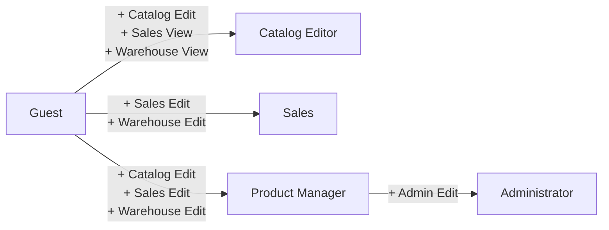

# Security

## Overview

*Shopfoo* implements a simplified but representative **claims-based access control** model. There is no real authentication layer (no Keycloak, no OAuth, no JWT verification): the *Login* page simply lets the user pick a persona/role for manual testing. This is sufficient for demo purposes while still exercising the same security patterns that a production app would use — claims checked both client-side and server-side.

## Domain model

The security types are defined in `Domain.Types/Security.fs`.

A `User` is either `Anonymous` or `LoggedIn` with a name and a set of `Claims`. Claims map a `Feat` (feature area) to an `Access` level:

```fsharp
type Access = View | Edit

type Feat = About | Admin | Catalog | Sales | Warehouse

type Claims = Map<Feat, Access>

type User =
    | Anonymous
    | LoggedIn of userName: string * claims: Claims
```

The `User` type exposes helpers to check access:

```fsharp
member user.CanAccess feat = ...    // bool — has any access to the feature
member user.AccessTo feat = ...     // Access option — the specific access level

// Active patterns for pattern matching
let (|UserCanAccess|_|) feat (user: User) = ...
let (|UserCanNotAccess|_|) feat (user: User) = ...
```

## Login page — role selection

Since there is no real authentication, the Login page (`Pages/Login.fs`) displays a table of predefined personas. The user clicks a row to "log in" as that persona.

The personas are defined in `Home/Data/Users.fs`:

| Persona         | About | Catalog | Sales | Warehouse | Admin |
| --------------- | ----- | ------- | ----- | --------- | ----- |
| Guest           | View  | View    | —     | —         | —     |
| Catalog Editor  | View  | Edit    | View  | View      | —     |
| Sales           | View  | View    | Edit  | Edit      | —     |
| Product Manager | View  | Edit    | Edit  | Edit      | —     |
| Administrator   | View  | Edit    | Edit  | Edit      | Edit  |

```fsharp
// Home/Data/Users.fs
module private Claims =
    let guest: Claims =
        Map [
            Feat.About, Access.View
            Feat.Catalog, Access.View
        ]

    let catalogEditor: Claims =
        guest
        |> Map.add Feat.Catalog Access.Edit
        |> Map.add Feat.Sales Access.View
        |> Map.add Feat.Warehouse Access.View

    let sales: Claims =
        guest
        |> Map.add Feat.Sales Access.Edit
        |> Map.add Feat.Warehouse Access.Edit

    let productManager: Claims =
        guest
        |> Map.add Feat.Catalog Access.Edit
        |> Map.add Feat.Sales Access.Edit
        |> Map.add Feat.Warehouse Access.Edit

    let admin: Claims =
        productManager
        |> Map.add Feat.Admin Access.Edit
```

The personas are built incrementally: each one extends a base persona by adding or upgrading feature access:



## Client-side access control

### Page routing (`View.fs`)

The main `AppView` determines which page to render based on the current route **and** the user's authentication state. Protected pages require a logged-in user; if the user is anonymous, the *Login* page is displayed inline (without URL redirection):

```fsharp
let pageToDisplayInline, featAccessToCheck =
    match model.Page, fullContext.User with
    // Public pages
    | Page.About, _
    | Page.Login, User.Anonymous -> model.Page, None

    // Protected pages — require login + feature access
    | Page.ProductIndex _, User.LoggedIn _
    | Page.ProductDetail _, User.LoggedIn _ -> model.Page, Some Feat.Catalog
    | Page.Admin, User.LoggedIn _ -> model.Page, Some Feat.Admin

    // Logged in but on Login/Home → redirect to default page
    | Page.Home, User.LoggedIn _
    | Page.Login, User.LoggedIn _ -> Page.ProductIndexDefaults, Some Feat.Catalog

    // Anonymous on protected page → show Login inline
    | Page.Admin, User.Anonymous
    | Page.Home, User.Anonymous
    | Page.ProductIndex _, User.Anonymous
    | Page.ProductDetail _, User.Anonymous -> Page.Login, None
```

After rendering, a `React.useEffect` hook checks that the user has the required feature access. If not, it redirects to a "Not Found" page:

```fsharp
React.useEffect (fun () ->
    match featAccessToCheck with
    | Some feat when not (fullContext.User.CanAccess feat) ->
        Router.navigatePage (Page.CurrentNotFound())
    | _ -> ()
)
```

### Conditional rendering in components

Individual components adapt their UI based on user claims.

**Product Details page** — the *Actions* column is only displayed when the user has `Sales` or `Warehouse` access and the product type supports it:

```fsharp
// Product/Details/Page.fs
let hasActions =
    match fullContext.User, sku.Type with
    | (UserCanAccess Feat.Sales | UserCanAccess Feat.Warehouse),
      (SKUType.FSID _ | SKUType.ISBN _) -> true
    | _ -> false
```

**Actions form** — within the *Actions* column, each action group uses `AccessTo` to determine the access level (`View` = read-only display, `Edit` = interactive actions):

```fsharp
// Product/Details/Actions.fs
// Price actions — requires Sales access
ActionsDropdown "list-price" ... (fullContext.User.AccessTo Feat.Sales) ...

// Stock actions — requires Warehouse access
ActionsDropdown "stock" ... (fullContext.User.AccessTo Feat.Warehouse) ...
```

## Server-side authorization

Claims are also verified server-side on every Remoting API call. The mechanism relies on several types working together — from the client-side `FullContext` down to the server-side `authorizeHandler`. The full Remoting pipeline is detailed in the [Remoting](remoting.md) page; here we focus on the security aspects.

### Passing the token with each request

The `FullContext` record (`Shared/Remoting.fs`) holds the current `User`, an optional `AuthToken`, the current `Lang`, and the loaded `Translations`:

```fsharp
type FullContext = {
    Lang: Lang
    User: User
    Token: AuthToken option       // ← serialized User
    Translations: AppTranslations
}
```

Every API call in `Shared/Remoting.fs` is typed as a function taking a `Request<'t>`:

```fsharp
type Request<'t> = {
    Token: AuthToken option
    Lang: Lang
    Body: 't
}

type Command<'command>        = Request<'command> -> Async<Response<unit>>
type Query<'query, 'response> = Request<'query>   -> Async<Response<'response>>
```

The `FullContext.PrepareRequest` extension method (declared in `Client/Remoting.fs`) builds a `Request` by copying the `Token` from the context:

```fsharp
member this.PrepareRequest body =
    let secureRequest: Request<'a> = {
        Token = this.Token
        Lang = this.Lang
        Body = body
    }
    this.Cmder, secureRequest
```

A convenience variant, `PrepareQueryWithTranslations`, wraps the query together with the translation pages to reload.

In practice, every page calls `fullContext.PrepareRequest` (or `PrepareQueryWithTranslations`) before invoking any API endpoint — for example:

```fsharp
Cmd.loadHomeData (fullContext.PrepareQueryWithTranslations())
Cmd.loadPrices   (fullContext.PrepareRequest sku)
Cmd.saveProduct  (fullContext.PrepareRequest product)
```

### Token issuance — server-side serialization

The `AuthToken` is a simple wrapper: `type AuthToken = AuthToken of string`.

When the *Login* page loads, it calls the `HomeApi.Index` endpoint which returns a list of `Persona` records — each containing a name, claims, and a pre-computed `AuthToken`:

```fsharp
type Persona = { Name: PersonaName; Claims: Claims; Token: AuthToken }

type HomeIndexResponse = { Personas: Persona list }
```

The token is produced **server-side** in the `IndexHandler` by serializing the corresponding `User` to JSON:

```fsharp
for name, claims in personas ->
    { Name = name
      Claims = claims
      Token = tokenFor (User.LoggedIn(name, claims)) }

// where tokenFor is defined in Security.fs:
let internal tokenFor user = user |> JsonFSharp.serialize |> AuthToken
```

When the user selects a persona, the client reconstructs the `User` and stores it alongside the `Token` in the `FullContext` via `WithPersona`:

```fsharp
member this.WithPersona(persona: Persona) =
    { this with
        User = User.LoggedIn(persona.Name, persona.Claims)
        Token = Some persona.Token }
```

From that point on, every API call made through `PrepareRequest` includes this token.

### Authorization handler (`Server/Remoting/Security.fs`)

On the server, `checkToken` extracts the `User` from the token with `JsonFSharp.deserialize` (reversing `tokenFor`) and compares its claims against the required ones. The `authorizeHandler` function wraps every API handler — it checks the token first, then delegates to the handler with the decoded `User`:

```fsharp
let authorizeHandler
    (claims: Claims)
    (handler: SecureRequestHandler<'requestBody, 'response>)
    request =
    async {
        match checkToken claims request.Token with
        | Error authError -> return Error(ServerError.AuthError authError)
        | Ok authorizedUser -> return! handler.Handle request.Lang request.Body authorizedUser
    }
```

### API endpoint authorization

Each API builder declares the required claims for its endpoints. For example:

```fsharp
// Catalog API — requires Catalog claims
GetProducts     = GetProductsHandler(...)     |> Security.authorizeHandler (claim Access.View)
SaveProduct     = SaveProductHandler(...)     |> Security.authorizeHandler (claim Access.Edit)

// Prices API — requires Sales or Warehouse claims depending on the operation
GetPrices       = GetPricesHandler(...)       |> Security.authorizeHandler (salesClaim Access.View)
SavePrices      = SavePricesHandler(...)      |> Security.authorizeHandler (salesClaim Access.Edit)
AdjustStock     = AdjustStockHandler(...)     |> Security.authorizeHandler stockClaims  // Sales.View + Warehouse.View
ReceiveSupply   = ReceiveSupplyHandler(...)   |> Security.authorizeHandler (warehouseClaim Access.Edit)

// Home API — no claims required (accessible to everyone, including Anonymous)
Index           = IndexHandler(...)           |> Security.authorizeHandler Claims.none
GetTranslations = GetTranslationsHandler(...) |> Security.authorizeHandler Claims.none
```

This ensures that even if a user bypasses client-side checks, the server rejects unauthorized requests.
