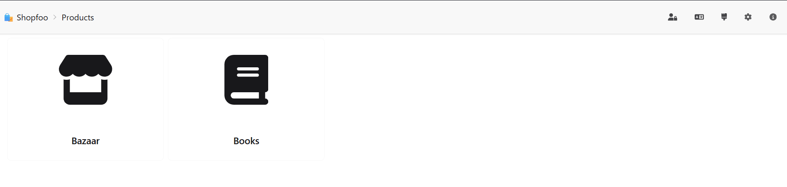
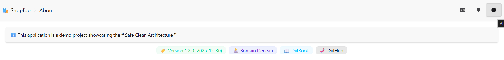

# General Features

This page covers the cross-cutting features available to all users: authentication, default landing page, and access-controlled pages that demonstrate Shopfoo's security model.

## Login

Shopfoo requires authentication, but uses a **simplified model with no real auth backend** (no OAuth, no JWT). The login page displays a table of predefined **personas**. The user clicks a row to instantly "log in" as that persona.


See the [Security](../front-end/security.md) chapter for the full claims-based access control model and token mechanism.


## Default page

After login, the application lands on the **Home page**, which displays the product catalogue. This is the main working area of the back-office.

## About page

The **About page** is accessible **without login** (anonymous mode). It is intentionally public to demonstrate how certain pages can bypass authentication — useful for testing public-access routes in the front-end security setup.


See the [Security](../front-end/security.md) chapter for how public routes are configured on the client side.


## Admin page

The **Admin page** is restricted to users who hold an **Admin Claim**. Attempting to access it without the claim results in an access-denied response, making it a useful test case for role-based access control (RBAC).


See the [Security](../front-end/security.md) chapter for how claim-based guards are implemented.


## Demo

