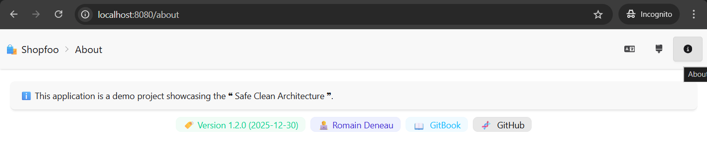
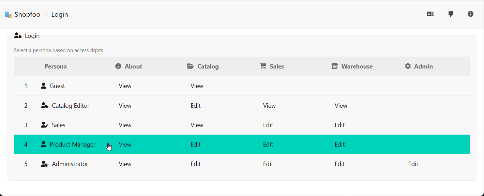
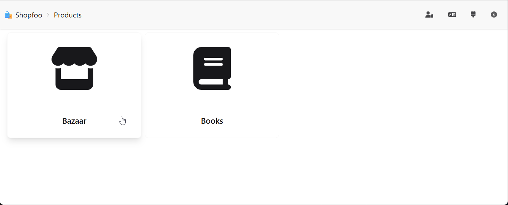
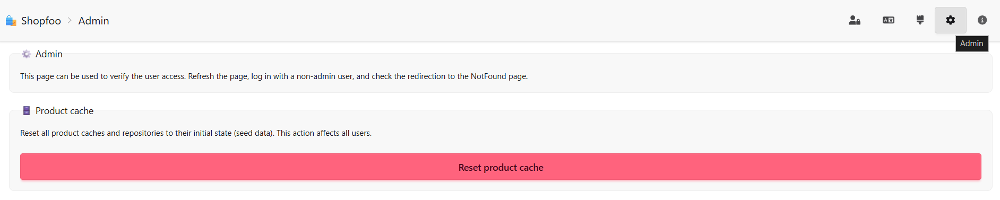
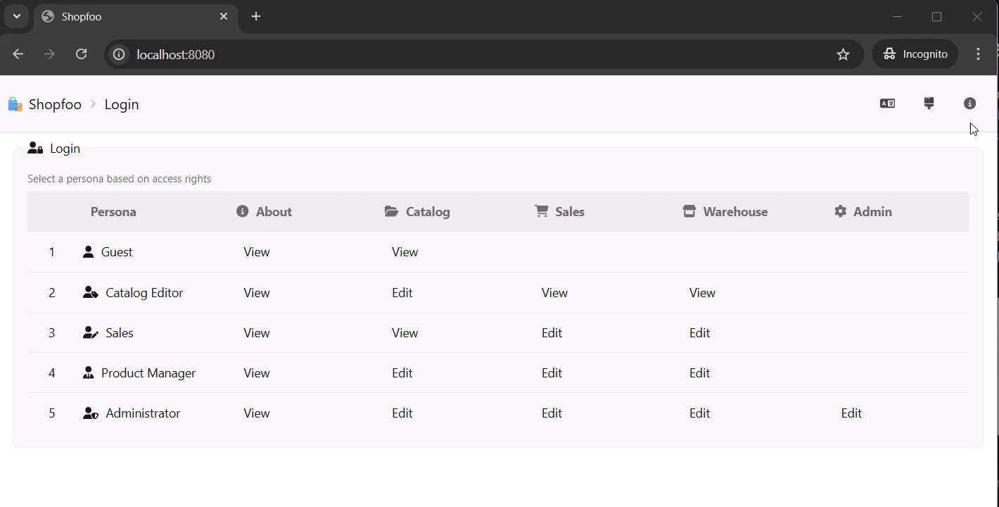

# General Features

This page covers the cross-cutting features available to all users: authentication, default landing page, and access-controlled pages that demonstrate Shopfoo's security model.

## About page

The **About page** presents Shopfoo as a demo project showcasing the _❝ Safe Clean Architecture ❞_. It displays four pieces of information:

* **🏷️ Version** — determined at deployment time using [SemVer](https://semver.org/) (Semantic Versioning), derived from the [Conventional Commits](https://www.conventionalcommits.org/) history since the previous deployment.
* **🧑‍💻 Authors** — the names of the project's authors.
* **📖 GitBook** — a link to this documentation.
* **🧬 GitHub** — a link to the Shopfoo source code repository.

This page is accessible **without login** (anonymous mode). It is intentionally public to demonstrate how certain pages can bypass authentication — useful for testing public-access routes in the front-end security setup.


See the [Security](../front-end/security.md) chapter for how public routes are configured on the client side.

See also the [Versioning](../front-end/versioning.md) page for how the version number is determined at deployment time.


## Login page

Shopfoo requires authentication, but uses a **simplified model with no real auth backend** (no OAuth, no JWT). The login page displays a table of predefined **personas**. The user clicks a row to instantly "log in" as that persona.


See the [Security](../front-end/security.md) chapter for the full claims-based access control model and token mechanism.


## Default page

After login, the application lands on the **Home page**, which displays the product catalog. This is the main working area of the back-office.


See the [Products](products.md) page for details on the product catalog.


## Admin page

The **Admin page** is restricted to users who hold an **Admin Claim**. Attempting to access it without the claim results in an access-denied response, making it a useful test case for role-based access control (RBAC).


See the [Security](../front-end/security.md) chapter for how claim-based guards are implemented.


## Demo

The following demo illustrates the features described on this page:

