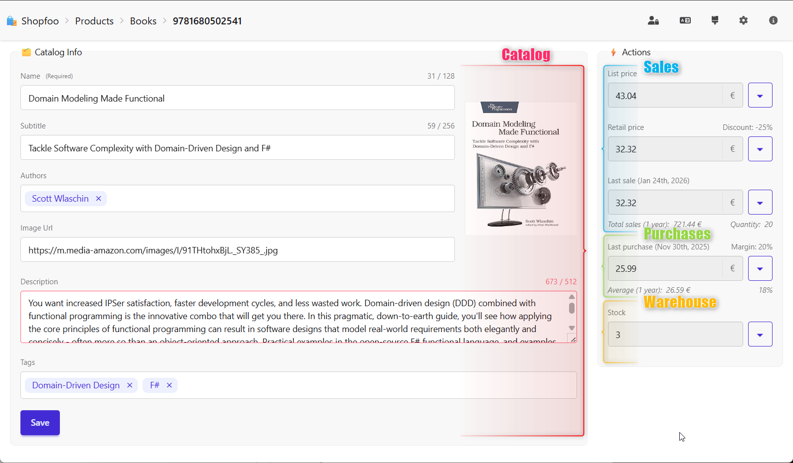
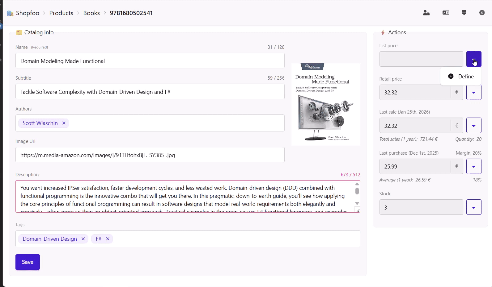
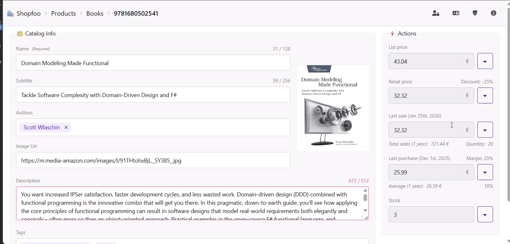
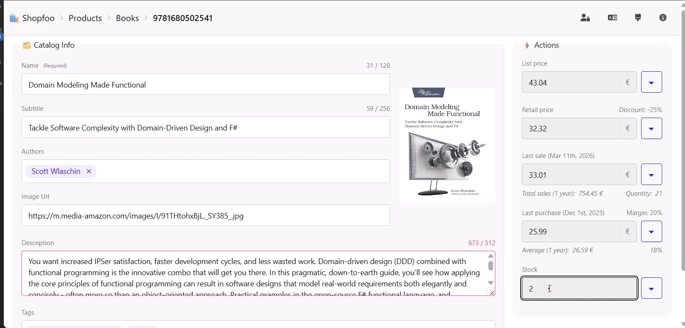
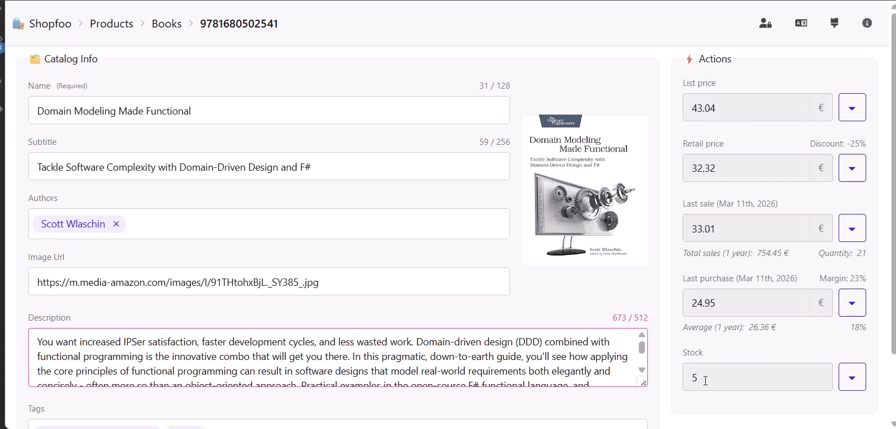

# Product Management

This page describes how products are managed in Shopfoo: editing product information, managing pricing, and simulating the business events that affect stock and sales.

## Business areas involved

Product management in Shopfoo spans four business areas:

| Area          | Responsibility                         | Claim            |
| ------------- | -------------------------------------- | ---------------- |
| **Catalog**   | Product information                    | `Feat.Catalog`   |
| **Sales**     | Pricing, customer orders and revenue   | `Feat.Sales`     |
| **Purchases** | Supplier orders and restocking         | `Feat.Warehouse` |
| **Warehouse** | Stock levels and inventory corrections | `Feat.Warehouse` |

Each business area on the product page is only rendered if the current user holds the corresponding claim. Within a visible area, the access level further determines the UI state: a **View** claim renders form components as read-only or disabled; an **Edit** claim enables full interaction.

## Task-Based UI approach

Rather than a single generic edit form, Shopfoo uses a **Task-Based UI**: each user intention maps to a dedicated, focused command. This avoids the anaemic CRUD screens typical of back-offices and makes the business intent explicit.


For an introduction to Task-Based UIs, see Derek Comartin's video [Task-Based UI](https://www.youtube.com/watch?v=BgRMHpqxVKA).


## Product editing

The **Edit product** task allows users to modify the descriptive information of a product. The fields available depend on the product type:

| Field       | 🏪 Bazaar | 📘 Books | Required | Max Length | Component                 |
| ----------- | :-------: | :------: | :------: | :--------: | ------------------------- |
| Name        |     ✅     |     ✅    |     ✅    |     128    | Text input                |
| Category    |     ✅     |     —    |     ✅    |      —     | Radio button group        |
| Subtitle    |     —     |     ✅    |          |     256    | Text input                |
| Authors     |     —     |     ✅    |          |      —     | Multi-select              |
| Image URL   |     ✅     |     ✅    |          |      —     | Text input + live preview |
| Description |     ✅     |     ✅    |          |     512    | Text input                |

Visual feedback guides the user during editing: a **character counter** (`remaining / max`) is displayed for length-constrained fields, and a **red border** highlights any field with an invalid value after edition.


See the [Validation](../front-end/validation.md) page for the front-end validation implementation details.


## Pricing management

The **Update pricing** task manages the two price fields independently:

* **Retail price** — the price charged to the customer.
* **List price** (MSRP) — the manufacturer's recommended retail price.

This is a separate task from general editing because pricing decisions often involve different roles or approval workflows.

The available pricing actions are:

| Action           | List price | Retail price | Condition    |
| ---------------- | :--------: | :----------: | ------------ |
| Define           |      ✅     |       ✅      | Price = None |
| Increase price   |      ✅     |       ✅      | Price ≠ None |
| Decrease price   |      ✅     |       ✅      | Price ≠ None |
| Remove           |      ✅     |       —      | Price ≠ None |
| Mark as sold out |      —     |       ✅      | Stock = 0    |

🖥️ <strong>Demo</strong>


The pricing drawer uses the [DaisyUI Drawer](https://daisyui.com/components/drawer/) component and opens from the **right**, pushing the "Actions" column to the left. This keeps all prices visible while the drawer is open — handy when entering a price relative to the others (e.g. for a book, the Retail Price should never exceed the List Price, even though nothing enforces this technically).


## Sales entry

The **Input sales** task simulates **customer purchases** on the storefront. It affects the **Sales** area (revenue) and the **Warehouse** area (stock decrease).

Users enter the sale date, then the quantity bought, and finally the sale price — which is pre-filled with the current Retail Price. The stock level is decremented accordingly.

🖥️ <strong>Demo</strong>

## Purchase entry

The **Receive purchased products** task simulates a **stock arrival from a supplier**. It represents goods received from a supplier, affecting both the **Purchases** area (supplier order) and the **Warehouse** area (stock increase).

Users enter the purchase date, then the quantity supplied, and finally the purchase price — which is not pre-filled. The stock level is incremented accordingly.

🖥️ <strong>Demo</strong>

## Stock adjustment

The **Inventory adjustment** task simulates an **inventory correction** following a warehouse count. It falls under the **Warehouse** area and allows entering a different quantity to reconcile the recorded stock with the physical count.

🖥️ <strong>Demo</strong>

