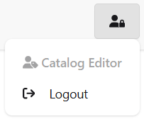
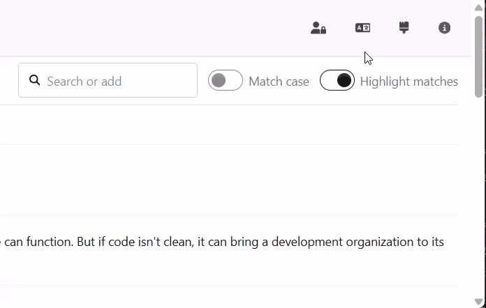
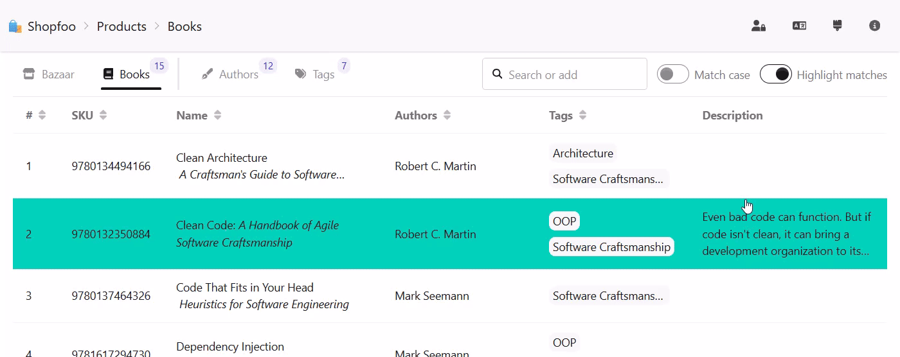

# Navigation & UI

The **navigation bar** sits at the top of every page and is split into two areas:

- **Left** — an interactive breadcrumb trail showing the current location in the application hierarchy.
- **Right** — dropdown menus (user, language, theme) followed by navigation links (Admin, About).

## Breadcrumb

A **breadcrumb trail** is displayed at the top of each page to show the user's current location within the application hierarchy.

| Url           | Logged in             | Breadcrumb                          |
| ------------- | --------------------- | ----------------------------------- |
| Any           | No                    | Shopfoo > Login                     |
| /about        | Any                   | Shopfoo > About                     |
| /admin        | Yes, as Administrator | Shopfoo > Admin                     |
| /             | Yes                   | Shopfoo > Products                  |
| /products     | Yes                   | Shopfoo > Products                  |
| /bazaar       | Yes                   | Shopfoo > Products > Bazaar         |
| /bazaar/{SKU} | Yes                   | Shopfoo > Products > Bazaar > {SKU} |
| /books        | Yes                   | Shopfoo > Products > Books          |
| /books/{SKU}  | Yes                   | Shopfoo > Products > Books > {SKU}  |

Each breadcrumb segment can act as a **navigation link** to move back up the hierarchy — except when the current URL is already the target, in which case the segment is rendered as plain text (no self-link):

- **Shopfoo** links to `/` (root), unless the current page is already `/`.
- **Products** links to `/products`, unless the current page is already `/products`.


See the [Front-end > Navigation](../front-end/navigation.md) chapter for the client-side routing and breadcrumb implementation.


## User menu

The **user menu** displays the name of the currently logged-in persona. It provides a **logout** action to return to the login page.

## Language menu

The **language menu** lets users switch the application's display language at runtime.

The Latin option is intentionally unimplemented. It demonstrates the error case where translations fail to load — a scenario that can occur in production when using an external translation API.


Translations are loaded on demand and cached on the client side. See the [Translations](../front-end/translations.md) chapter for the i18n architecture and strongly-typed translation helpers.


## Theme menu

The **theme menu** lets users choose a visual theme for the application. Eight themes are available — a curated selection of dark and light themes from [DaisyUI](https://daisyui.com) — applied dynamically without a page reload:

## Navigation links

The right end of the navigation bar contains two direct links:

- **Admin** — visible and accessible only to users whose claims include Admin access.
- **About** — always visible, accessible to everyone including anonymous users.


The [General Features](general.md#demo) page includes a demo showing the Admin and About pages in context.
