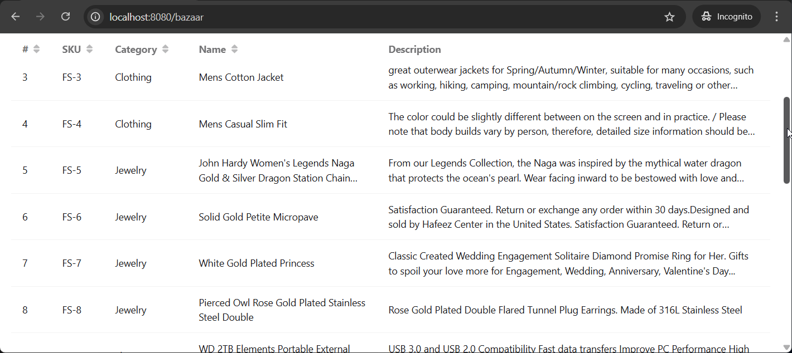
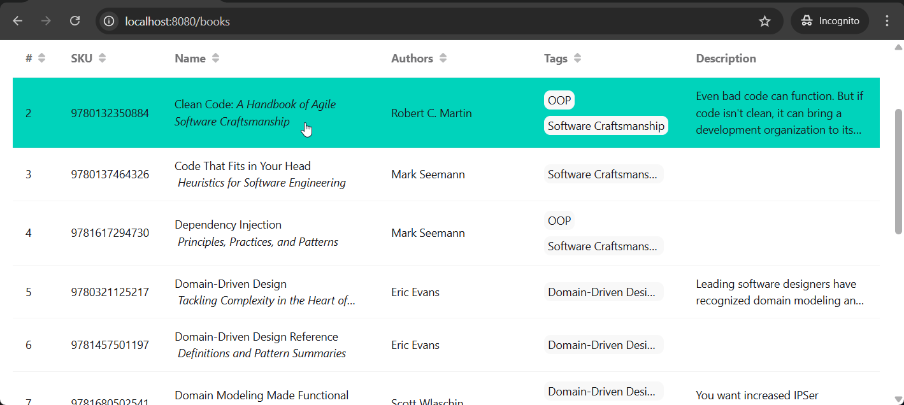
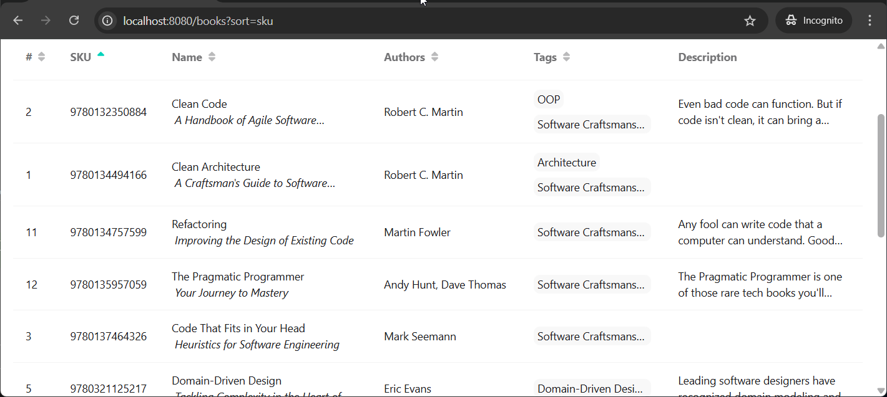
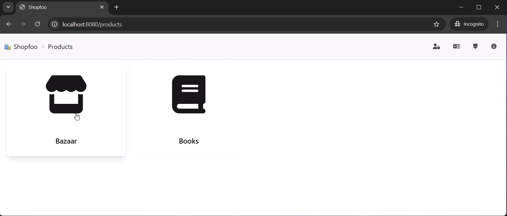
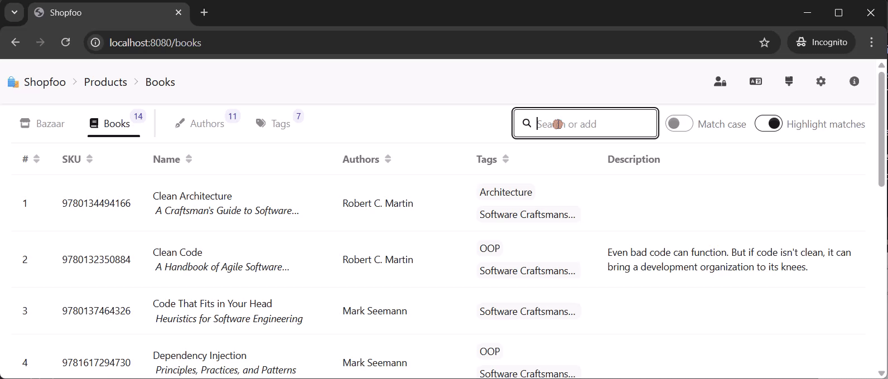
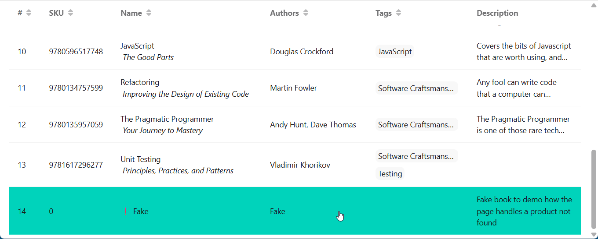
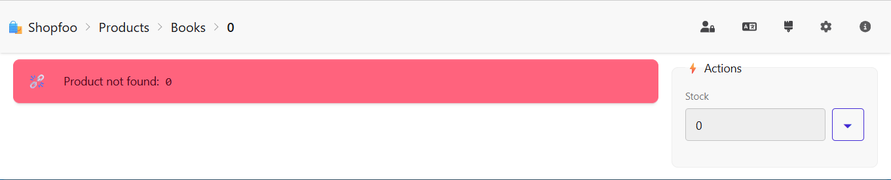

# Products

This page describes how Shopfoo fetches, caches, and displays its product catalog, and how users can search and filter products.


All display state — active filters, search term, sort column and direction — is reflected in the URL. Any combination can be bookmarked or shared as a direct link.


## Provider choice

Shopfoo sells two types of products, each sourced from a different external API:

<table><thead><tr><th width="197">Provider</th><th width="158.199951171875">Type</th><th>Categories</th></tr></thead><tbody><tr><td><a href="https://fakestoreapi.com">FakeStore API</a></td><td><strong>🏪 Bazaar</strong></td><td>👗 Clothing, 🔌 Electronics, 💍 Jewelry</td></tr><tr><td><a href="https://openlibrary.org/developers/api">OpenLibrary API</a></td><td><strong>📘 Books</strong></td><td>📚 Books</td></tr></tbody></table>

## Cache & Seeding

The application relies on an **in-memory cache** — there is no persistent database. On startup, a **seeding phase** populates the cache with around fifteen books. Products are then added and updated **progressively** as the user interacts with the application: browsing a product for the first time fetches it from the external API and stores it in the cache.

The provider is determined by the product type and is transparent to the user.

## Table display

Products are listed in a **sortable table**. The table header is **sticky**: it remains visible at the top of the page while scrolling down through a long list.

Each row shows the key product attributes:

| Column      | 🏪 Bazaar | 📘 Books | Notes                            |
| ----------- | :-------: | :------: | -------------------------------- |
| #           |     ✅     |     ✅    | Row number                       |
| SKU         |     ✅     |     ✅    |                                  |
| Category    |     ✅     |     —    |                                  |
| Name        |     ✅     |     ✅    | Books: title + optional subtitle |
| Authors     |     —     |     ✅    |                                  |
| Tags        |     —     |     ✅    |                                  |
| Description |     ✅     |     ✅    |                                  |

### Bazaar



### Books



### Truncation

Long text cells (**Name** and **Description**) are truncated with an ellipsis and capped at 2 lines by default. On mouse hover, the row expands to reveal up to 3 lines. For books specifically, the **Name** column also changes layout on hover: the two-line `Title ↵ Subtitle` view collapses into a single `Title: Subtitle` line.

Example:

```txt
┌────────┬──────────────────────────────────┬───────────────────────────────────────┐
│ State  │ Name                             │ Description                           │
├────────┼──────────────────────────────────┼───────────────────────────────────────┤
│ Normal │ Clean Code                       │ Even bad code can function. But if    │
│        │ A Handbook of Agile Software…    │ code isn't clean, it can bring a…     │
├────────┼──────────────────────────────────┼───────────────────────────────────────┤
│ Hover  │ Clean Code: A Handbook of Agile  │ Even bad code can function. But if    │
│        │ Software Craftsmanship           │ code isn't clean, it can bring a      │
│        │                                  │ development organization to its…      │
└────────┴──────────────────────────────────┴───────────────────────────────────────┘
```

### Sorting

All columns except **Description** are sortable. Clicking a column header cycles through ascending and descending order. An icon in the header indicates the current sort state:

| Icon | Color | Meaning                        |
| ---- | ----- | ------------------------------ |
| ⏶⏷   | Grey  | Sortable, not currently sorted |
| ⏶    | Green | Sorted ascending               |
| ⏷    | Green | Sorted descending              |



## Filter & search

The product page has its own **toolbar** above the table, organized in three parts:

**1. Product type switcher** — selects between 🏪 Bazaar and 📘 Books. The total number of products of the selected type is displayed next to the label, independently of any active filters.

**2. Attribute filters** — faceted filters that vary by product type:

<table><thead><tr><th width="166.79998779296875">Type</th><th>Filters</th></tr></thead><tbody><tr><td>🏪 Bazaar</td><td>One filter with 3 positions: 👕 Clothing, 📺 Electronics, 💎 Jewelry</td></tr><tr><td>📘 Books</td><td>Two dropdown filters: Authors and Tags</td></tr></tbody></table>

Each filter option shows the number of matching products.

When a filter is active, the matching values in the corresponding table column are highlighted — governed by the same **Highlight matches** toggle as the text search.

**3. Text search** — a free-text input that searches across all table columns (except the row number `#`). Only rows containing the search term are displayed. Two options complement the search:

* **Case-sensitive** — toggles case sensitivity (disabled by default).
* **Highlight matches** — found occurrences are highlighted in the results (enabled by default).

<details open>

<summary><span data-gb-custom-inline data-tag="emoji" data-code="1f5a5">🖥️</span> <strong>Demo</strong></summary>



</details>

## Open Library search

When browsing 📘 **Books** with an active text search term, a 🔍 **search button** appears in the toolbar. Clicking it triggers a query to the _Open Library API_ using the current search term, fetching up to **30 results**. Those results are then re-filtered locally by the same text search to produce the final list, which is merged directly into the table alongside the books already in the cache. Books loaded this way are identifiable by the ✨ emoji prefixed to their title.

<details open>

<summary><span data-gb-custom-inline data-tag="emoji" data-code="1f5a5">🖥️</span> <strong>Demo</strong></summary>



</details>

From there, a selected book can be permanently added to the in-memory cache — this is covered in detail in the [Product Management](management.md) page.

## Fake product

Both product lists — Bazaar and Books — include a **fake product** appended at the end. Its purpose is to exercise the product detail page in an error scenario: navigating to it triggers a "product not found" state, since no matching product exists in the cache or the external API.




